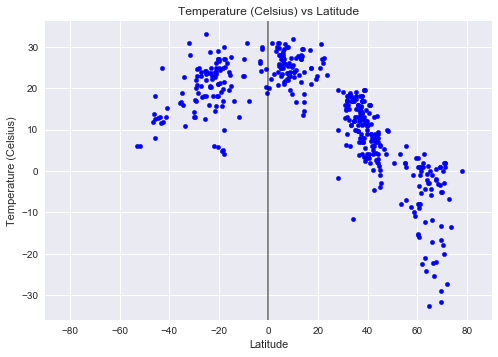
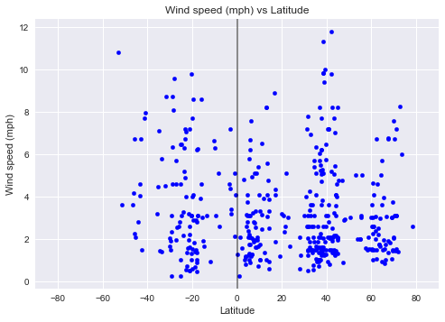

# Weather analysis - Approaching Equator

Data's true power lies in its ability to answer questions definitively. In this project, we are going to answer a fundamental question: "What's the weather like as we approach the equator?"

Now, we all might think, "Duh. It gets hotter..."

But let's try and prove it.

NOTE: This project takes into account only the weather info from one particular day. This can be viewed as a proof as concept


```python
#Import Dependencies
from config import api_keys
from citipy import citipy

import random
import requests

import pandas as pd
import numpy as np

import matplotlib.pyplot as plt

import matplotlib

# Set style for plots
plt.style.use("seaborn")
```

## Choosing representative sample set


```python
# For the selected coordinates, use citipy to associate them with nearest city.

cities_df["Closest City name"] = ""
cities_df["Closest Country code"] = ""
for index,row in cities_df.iterrows():
    city = citipy.nearest_city(row["Latitude"],row["Longitude"])
    cities_df.set_value(index,"Closest City name",city.city_name)
    cities_df.set_value(index,"Closest Country code",city.country_code)

```


```python
# Dropping random lat and lon samples from dataframe as they are not the exact coordinates for the cities.

clean_cities_df = cities_df.drop(['Latitude', 'Longitude'],axis=1)
clean_cities_df

# Dropping duplicate cities which may have resulted in the previous step
clean_cities_df = clean_cities_df.drop_duplicates()

clean_cities_df.shape


```


    (874, 2)


```python

# Picking a sample of 500 cities to proceed with analysis
selected_cities = clean_cities_df.sample(500)

selected_cities = selected_cities.reset_index(drop=True)

```

## Fetch City Weather info - OpenWeatherMap 


```python
# Setting up values for OpenWeatherMap API calls
base_url = "http://api.openweathermap.org/data/2.5/weather"

app_id = api_keys["open_weather_map_common"]

params = { "appid" :app_id,"units":"metric" }
```


```python
# SAMPLE JSON RESPONSE - 
#{"coord":{"lon":-0.13,"lat":51.51},
#"weather":[{"id":300,"main":"Drizzle","description":"light intensity drizzle","icon":"09d"}],
#"base":"stations",
#"main":{"temp":280.32,"pressure":1012,"humidity":81,"temp_min":279.15,"temp_max":281.15},
#"visibility":10000,
# "wind":{"speed":4.1,"deg":80},
# "clouds":{"all":90},
# "dt":1485789600,
# "sys":{"type":1,"id":5091,"message":0.0103,"country":"GB","sunrise":1485762037,"sunset":1485794875},
# "id":2643743,"name":"London","cod":200}

def encrypt_key(input_url):
    return input_url[0:53]+"<YourKey>"+input_url[85:]

for index,row in selected_cities.iterrows():
    params["q"] =f'{row["Closest City name"]},{row["Closest Country code"]}'
    print(f"Retrieving weather information for {params['q']}")
    city_weather_resp = requests.get(base_url,params)
    print(encrypt_key(city_weather_resp.url))
    city_weather_resp  = city_weather_resp.json()
    selected_cities.set_value(index,"Latitude",city_weather_resp.get("coord",{}).get("lat"))
    selected_cities.set_value(index,"Longitude",city_weather_resp.get("coord",{}).get("lon"))
    selected_cities.set_value(index,"Temperature",city_weather_resp.get("main",{}).get("temp_max"))
    selected_cities.set_value(index,"Wind speed",city_weather_resp.get("wind",{}).get("speed"))
    selected_cities.set_value(index,"Humidity",city_weather_resp.get("main",{}).get("humidity"))
    selected_cities.set_value(index,"Cloudiness",city_weather_resp.get("clouds",{}).get("all"))
    

```

    Retrieving weather information for ponta delgada,pt
    http://api.openweathermap.org/data/2.5/weather?appid=<YourKey>&units=metric&q=ponta+delgada%2Cpt
    Retrieving weather information for avarua,ck
    http://api.openweathermap.org/data/2.5/weather?appid=<YourKey>&units=metric&q=avarua%2Cck
    Retrieving weather information for pangnirtung,ca
    http://api.openweathermap.org/data/2.5/weather?appid=<YourKey>&units=metric&q=pangnirtung%2Cca
    Retrieving weather information for semirom,ir
    http://api.openweathermap.org/data/2.5/weather?appid=<YourKey>&units=metric&q=semirom%2Cir
    Retrieving weather information for kuytun,cn
    http://api.openweathermap.org/data/2.5/weather?appid=<YourKey>&units=metric&q=kuytun%2Ccn
    Retrieving weather information for kang,bw
    http://api.openweathermap.org/data/2.5/weather?appid=<YourKey>&units=metric&q=kang%2Cbw
    Retrieving weather information for dalby,au
    http://api.openweathermap.org/data/2.5/weather?appid=<YourKey>&units=metric&q=dalby%2Cau
    Retrieving weather information for hilo,us
    http://api.openweathermap.org/data/2.5/weather?appid=<YourKey>&units=metric&q=hilo%2Cus
    Retrieving weather information for belushya guba,ru
    http://api.openweathermap.org/data/2.5/weather?appid=<YourKey>&units=metric&q=belushya+guba%2Cru
    Retrieving weather information for seaca de padure,ro
    http://api.openweathermap.org/data/2.5/weather?appid=<YourKey>&units=metric&q=seaca+de+padure%2Cro
    Retrieving weather information for ontario,us
    http://api.openweathermap.org/data/2.5/weather?appid=<YourKey>&units=metric&q=ontario%2Cus
    Retrieving weather information for lithakia,gr
    http://api.openweathermap.org/data/2.5/weather?appid=<YourKey>&units=metric&q=lithakia%2Cgr
    Retrieving weather information for afyonkarahisar,tr
    http://api.openweathermap.org/data/2.5/weather?appid=<YourKey>&units=metric&q=afyonkarahisar%2Ctr
    Retrieving weather information for hobyo,so
    http://api.openweathermap.org/data/2.5/weather?appid=<YourKey>&units=metric&q=hobyo%2Cso
    Retrieving weather information for washington,us
    http://api.openweathermap.org/data/2.5/weather?appid=<YourKey>&units=metric&q=washington%2Cus
    Retrieving weather information for sinjah,sd
    http://api.openweathermap.org/data/2.5/weather?appid=<YourKey>&units=metric&q=sinjah%2Csd
    Retrieving weather information for lagoa,pt
    http://api.openweathermap.org/data/2.5/weather?appid=<YourKey>&units=metric&q=lagoa%2Cpt
    Retrieving weather information for belomorsk,ru
    http://api.openweathermap.org/data/2.5/weather?appid=<YourKey>&units=metric&q=belomorsk%2Cru
    Retrieving weather information for christchurch,nz
    http://api.openweathermap.org/data/2.5/weather?appid=<YourKey>&units=metric&q=christchurch%2Cnz
    Retrieving weather information for kintampo,gh
    http://api.openweathermap.org/data/2.5/weather?appid=<YourKey>&units=metric&q=kintampo%2Cgh
    Retrieving weather information for masunga,bw
    http://api.openweathermap.org/data/2.5/weather?appid=<YourKey>&units=metric&q=masunga%2Cbw
    Retrieving weather information for komsomolskiy,ru
    http://api.openweathermap.org/data/2.5/weather?appid=<YourKey>&units=metric&q=komsomolskiy%2Cru
    Retrieving weather information for artyk,ru
    http://api.openweathermap.org/data/2.5/weather?appid=<YourKey>&units=metric&q=artyk%2Cru
    Retrieving weather information for moura,pt
    http://api.openweathermap.org/data/2.5/weather?appid=<YourKey>&units=metric&q=moura%2Cpt
    Retrieving weather information for shenjiamen,cn
    http://api.openweathermap.org/data/2.5/weather?appid=<YourKey>&units=metric&q=shenjiamen%2Ccn
    Retrieving weather information for sabzevar,ir
    http://api.openweathermap.org/data/2.5/weather?appid=<YourKey>&units=metric&q=sabzevar%2Cir
    Retrieving weather information for sao joao da barra,br
    http://api.openweathermap.org/data/2.5/weather?appid=<YourKey>&units=metric&q=sao+joao+da+barra%2Cbr
    Retrieving weather information for farah,af
    http://api.openweathermap.org/data/2.5/weather?appid=<YourKey>&units=metric&q=farah%2Caf
    Retrieving weather information for abapo,bo
    http://api.openweathermap.org/data/2.5/weather?appid=<YourKey>&units=metric&q=abapo%2Cbo
    Retrieving weather information for yatou,cn
    http://api.openweathermap.org/data/2.5/weather?appid=<YourKey>&units=metric&q=yatou%2Ccn
    Retrieving weather information for nador,ma
    http://api.openweathermap.org/data/2.5/weather?appid=<YourKey>&units=metric&q=nador%2Cma
    Retrieving weather information for bambous virieux,mu
    http://api.openweathermap.org/data/2.5/weather?appid=<YourKey>&units=metric&q=bambous+virieux%2Cmu
    Retrieving weather information for brownwood,us
    http://api.openweathermap.org/data/2.5/weather?appid=<YourKey>&units=metric&q=brownwood%2Cus
    Retrieving weather information for villazon,bo
    http://api.openweathermap.org/data/2.5/weather?appid=<YourKey>&units=metric&q=villazon%2Cbo
    Retrieving weather information for beysehir,tr
    http://api.openweathermap.org/data/2.5/weather?appid=<YourKey>&units=metric&q=beysehir%2Ctr
    Retrieving weather information for kailua,us
    http://api.openweathermap.org/data/2.5/weather?appid=<YourKey>&units=metric&q=kailua%2Cus
    Retrieving weather information for illoqqortoormiut,gl
    http://api.openweathermap.org/data/2.5/weather?appid=<YourKey>&units=metric&q=illoqqortoormiut%2Cgl
    Retrieving weather information for vila velha,br
    http://api.openweathermap.org/data/2.5/weather?appid=<YourKey>&units=metric&q=vila+velha%2Cbr
    Retrieving weather information for severo-yeniseyskiy,ru
    http://api.openweathermap.org/data/2.5/weather?appid=<YourKey>&units=metric&q=severo-yeniseyskiy%2Cru
    Retrieving weather information for corinth,us
    http://api.openweathermap.org/data/2.5/weather?appid=<YourKey>&units=metric&q=corinth%2Cus
    Retrieving weather information for hengshui,cn
    http://api.openweathermap.org/data/2.5/weather?appid=<YourKey>&units=metric&q=hengshui%2Ccn
    Retrieving weather information for nyrob,ru
    http://api.openweathermap.org/data/2.5/weather?appid=<YourKey>&units=metric&q=nyrob%2Cru
    Retrieving weather information for ransang,ph
    http://api.openweathermap.org/data/2.5/weather?appid=<YourKey>&units=metric&q=ransang%2Cph
    Retrieving weather information for tarakan,id
    http://api.openweathermap.org/data/2.5/weather?appid=<YourKey>&units=metric&q=tarakan%2Cid
    Retrieving weather information for oistins,bb
    http://api.openweathermap.org/data/2.5/weather?appid=<YourKey>&units=metric&q=oistins%2Cbb
    Retrieving weather information for varkaus,fi
    http://api.openweathermap.org/data/2.5/weather?appid=<YourKey>&units=metric&q=varkaus%2Cfi
    Retrieving weather information for forrest city,us
    http://api.openweathermap.org/data/2.5/weather?appid=<YourKey>&units=metric&q=forrest+city%2Cus
    Retrieving weather information for zwedru,lr
    http://api.openweathermap.org/data/2.5/weather?appid=<YourKey>&units=metric&q=zwedru%2Clr
    Retrieving weather information for coxim,br
    http://api.openweathermap.org/data/2.5/weather?appid=<YourKey>&units=metric&q=coxim%2Cbr
    Retrieving weather information for ust-kulom,ru
    http://api.openweathermap.org/data/2.5/weather?appid=<YourKey>&units=metric&q=ust-kulom%2Cru
    Retrieving weather information for waconia,us
    http://api.openweathermap.org/data/2.5/weather?appid=<YourKey>&units=metric&q=waconia%2Cus
    Retrieving weather information for mehamn,no
    http://api.openweathermap.org/data/2.5/weather?appid=<YourKey>&units=metric&q=mehamn%2Cno
    Retrieving weather information for cehegin,es
    http://api.openweathermap.org/data/2.5/weather?appid=<YourKey>&units=metric&q=cehegin%2Ces
    Retrieving weather information for eureka,us
    http://api.openweathermap.org/data/2.5/weather?appid=<YourKey>&units=metric&q=eureka%2Cus
    Retrieving weather information for san lorenzo,bo
    http://api.openweathermap.org/data/2.5/weather?appid=<YourKey>&units=metric&q=san+lorenzo%2Cbo
    Retrieving weather information for pacifica,us
    http://api.openweathermap.org/data/2.5/weather?appid=<YourKey>&units=metric&q=pacifica%2Cus
    Retrieving weather information for atascadero,us
    http://api.openweathermap.org/data/2.5/weather?appid=<YourKey>&units=metric&q=atascadero%2Cus
    Retrieving weather information for champerico,gt
    http://api.openweathermap.org/data/2.5/weather?appid=<YourKey>&units=metric&q=champerico%2Cgt
    Retrieving weather information for brookhaven,us
    http://api.openweathermap.org/data/2.5/weather?appid=<YourKey>&units=metric&q=brookhaven%2Cus
    Retrieving weather information for severnyy,ru
    http://api.openweathermap.org/data/2.5/weather?appid=<YourKey>&units=metric&q=severnyy%2Cru
    Retrieving weather information for burnie,au
    http://api.openweathermap.org/data/2.5/weather?appid=<YourKey>&units=metric&q=burnie%2Cau
    Retrieving weather information for charters towers,au
    http://api.openweathermap.org/data/2.5/weather?appid=<YourKey>&units=metric&q=charters+towers%2Cau
    Retrieving weather information for itarema,br
    http://api.openweathermap.org/data/2.5/weather?appid=<YourKey>&units=metric&q=itarema%2Cbr
    Retrieving weather information for tabiauea,ki
    http://api.openweathermap.org/data/2.5/weather?appid=<YourKey>&units=metric&q=tabiauea%2Cki
    Retrieving weather information for chernyshevskiy,ru
    http://api.openweathermap.org/data/2.5/weather?appid=<YourKey>&units=metric&q=chernyshevskiy%2Cru
    Retrieving weather information for herat,af
    http://api.openweathermap.org/data/2.5/weather?appid=<YourKey>&units=metric&q=herat%2Caf
    Retrieving weather information for kota kinabalu,my
    http://api.openweathermap.org/data/2.5/weather?appid=<YourKey>&units=metric&q=kota+kinabalu%2Cmy
    Retrieving weather information for lexington,us
    http://api.openweathermap.org/data/2.5/weather?appid=<YourKey>&units=metric&q=lexington%2Cus
    Retrieving weather information for buariki,ki
    http://api.openweathermap.org/data/2.5/weather?appid=<YourKey>&units=metric&q=buariki%2Cki
    Retrieving weather information for santa cruz,cr
    http://api.openweathermap.org/data/2.5/weather?appid=<YourKey>&units=metric&q=santa+cruz%2Ccr
    Retrieving weather information for high level,ca
    http://api.openweathermap.org/data/2.5/weather?appid=<YourKey>&units=metric&q=high+level%2Cca
    Retrieving weather information for comodoro rivadavia,ar
    http://api.openweathermap.org/data/2.5/weather?appid=<YourKey>&units=metric&q=comodoro+rivadavia%2Car
    Retrieving weather information for chimoio,mz
    http://api.openweathermap.org/data/2.5/weather?appid=<YourKey>&units=metric&q=chimoio%2Cmz
    Retrieving weather information for carcassonne,fr
    http://api.openweathermap.org/data/2.5/weather?appid=<YourKey>&units=metric&q=carcassonne%2Cfr
    Retrieving weather information for uusikaupunki,fi
    http://api.openweathermap.org/data/2.5/weather?appid=<YourKey>&units=metric&q=uusikaupunki%2Cfi
    Retrieving weather information for kemijarvi,fi
    http://api.openweathermap.org/data/2.5/weather?appid=<YourKey>&units=metric&q=kemijarvi%2Cfi
    Retrieving weather information for saskylakh,ru
    http://api.openweathermap.org/data/2.5/weather?appid=<YourKey>&units=metric&q=saskylakh%2Cru
    Retrieving weather information for taltal,cl
    http://api.openweathermap.org/data/2.5/weather?appid=<YourKey>&units=metric&q=taltal%2Ccl
    Retrieving weather information for filingue,ne
    http://api.openweathermap.org/data/2.5/weather?appid=<YourKey>&units=metric&q=filingue%2Cne
    Retrieving weather information for filadelfia,py
    http://api.openweathermap.org/data/2.5/weather?appid=<YourKey>&units=metric&q=filadelfia%2Cpy
    Retrieving weather information for mujiayingzi,cn
    http://api.openweathermap.org/data/2.5/weather?appid=<YourKey>&units=metric&q=mujiayingzi%2Ccn
    Retrieving weather information for mys shmidta,ru
    http://api.openweathermap.org/data/2.5/weather?appid=<YourKey>&units=metric&q=mys+shmidta%2Cru
    Retrieving weather information for richards bay,za
    http://api.openweathermap.org/data/2.5/weather?appid=<YourKey>&units=metric&q=richards+bay%2Cza
    Retrieving weather information for oruro,bo
    http://api.openweathermap.org/data/2.5/weather?appid=<YourKey>&units=metric&q=oruro%2Cbo
    Retrieving weather information for werda,bw
    http://api.openweathermap.org/data/2.5/weather?appid=<YourKey>&units=metric&q=werda%2Cbw
    Retrieving weather information for vizinga,ru
    http://api.openweathermap.org/data/2.5/weather?appid=<YourKey>&units=metric&q=vizinga%2Cru
    Retrieving weather information for akdepe,tm
    http://api.openweathermap.org/data/2.5/weather?appid=<YourKey>&units=metric&q=akdepe%2Ctm
    Retrieving weather information for uyuni,bo
    http://api.openweathermap.org/data/2.5/weather?appid=<YourKey>&units=metric&q=uyuni%2Cbo
    Retrieving weather information for anchorage,us
    http://api.openweathermap.org/data/2.5/weather?appid=<YourKey>&units=metric&q=anchorage%2Cus
    Retrieving weather information for akropong,gh
    http://api.openweathermap.org/data/2.5/weather?appid=<YourKey>&units=metric&q=akropong%2Cgh
    Retrieving weather information for rikitea,pf
    http://api.openweathermap.org/data/2.5/weather?appid=<YourKey>&units=metric&q=rikitea%2Cpf
    Retrieving weather information for mrirt,ma
    http://api.openweathermap.org/data/2.5/weather?appid=<YourKey>&units=metric&q=mrirt%2Cma
    Retrieving weather information for pisco,pe
    http://api.openweathermap.org/data/2.5/weather?appid=<YourKey>&units=metric&q=pisco%2Cpe
    Retrieving weather information for saint-pierre,pm
    http://api.openweathermap.org/data/2.5/weather?appid=<YourKey>&units=metric&q=saint-pierre%2Cpm
    Retrieving weather information for miyako,jp
    http://api.openweathermap.org/data/2.5/weather?appid=<YourKey>&units=metric&q=miyako%2Cjp
    Retrieving weather information for fereydun kenar,ir
    http://api.openweathermap.org/data/2.5/weather?appid=<YourKey>&units=metric&q=fereydun+kenar%2Cir
    Retrieving weather information for soldotna,us
    http://api.openweathermap.org/data/2.5/weather?appid=<YourKey>&units=metric&q=soldotna%2Cus
    Retrieving weather information for lima,pe
    http://api.openweathermap.org/data/2.5/weather?appid=<YourKey>&units=metric&q=lima%2Cpe
    Retrieving weather information for verkhnevilyuysk,ru
    http://api.openweathermap.org/data/2.5/weather?appid=<YourKey>&units=metric&q=verkhnevilyuysk%2Cru
    Retrieving weather information for umm jarr,sd
    http://api.openweathermap.org/data/2.5/weather?appid=<YourKey>&units=metric&q=umm+jarr%2Csd
    Retrieving weather information for matara,lk
    http://api.openweathermap.org/data/2.5/weather?appid=<YourKey>&units=metric&q=matara%2Clk
    Retrieving weather information for gasa,bt
    http://api.openweathermap.org/data/2.5/weather?appid=<YourKey>&units=metric&q=gasa%2Cbt
    Retrieving weather information for botou,cn
    http://api.openweathermap.org/data/2.5/weather?appid=<YourKey>&units=metric&q=botou%2Ccn
    Retrieving weather information for coihaique,cl
    http://api.openweathermap.org/data/2.5/weather?appid=<YourKey>&units=metric&q=coihaique%2Ccl
    Retrieving weather information for tshane,bw
    http://api.openweathermap.org/data/2.5/weather?appid=<YourKey>&units=metric&q=tshane%2Cbw
    Retrieving weather information for villamontes,bo
    http://api.openweathermap.org/data/2.5/weather?appid=<YourKey>&units=metric&q=villamontes%2Cbo
    Retrieving weather information for rancho grande,hn
    http://api.openweathermap.org/data/2.5/weather?appid=<YourKey>&units=metric&q=rancho+grande%2Chn
    Retrieving weather information for pochutla,mx
    http://api.openweathermap.org/data/2.5/weather?appid=<YourKey>&units=metric&q=pochutla%2Cmx
    Retrieving weather information for tautira,pf
    http://api.openweathermap.org/data/2.5/weather?appid=<YourKey>&units=metric&q=tautira%2Cpf
    Retrieving weather information for suicheng,cn
    http://api.openweathermap.org/data/2.5/weather?appid=<YourKey>&units=metric&q=suicheng%2Ccn
    Retrieving weather information for olafsvik,is
    http://api.openweathermap.org/data/2.5/weather?appid=<YourKey>&units=metric&q=olafsvik%2Cis
    Retrieving weather information for ngunguru,nz
    http://api.openweathermap.org/data/2.5/weather?appid=<YourKey>&units=metric&q=ngunguru%2Cnz
    Retrieving weather information for nizhneyansk,ru
    http://api.openweathermap.org/data/2.5/weather?appid=<YourKey>&units=metric&q=nizhneyansk%2Cru
    Retrieving weather information for volksrust,za
    http://api.openweathermap.org/data/2.5/weather?appid=<YourKey>&units=metric&q=volksrust%2Cza
    Retrieving weather information for rundu,na
    http://api.openweathermap.org/data/2.5/weather?appid=<YourKey>&units=metric&q=rundu%2Cna
    Retrieving weather information for birjand,ir
    http://api.openweathermap.org/data/2.5/weather?appid=<YourKey>&units=metric&q=birjand%2Cir
    Retrieving weather information for warqla,dz
    http://api.openweathermap.org/data/2.5/weather?appid=<YourKey>&units=metric&q=warqla%2Cdz
    Retrieving weather information for pokhara,np
    http://api.openweathermap.org/data/2.5/weather?appid=<YourKey>&units=metric&q=pokhara%2Cnp
    Retrieving weather information for ketchikan,us
    http://api.openweathermap.org/data/2.5/weather?appid=<YourKey>&units=metric&q=ketchikan%2Cus
    Retrieving weather information for roald,no
    http://api.openweathermap.org/data/2.5/weather?appid=<YourKey>&units=metric&q=roald%2Cno
    Retrieving weather information for sur,om
    http://api.openweathermap.org/data/2.5/weather?appid=<YourKey>&units=metric&q=sur%2Com
    Retrieving weather information for laguna,br
    http://api.openweathermap.org/data/2.5/weather?appid=<YourKey>&units=metric&q=laguna%2Cbr
    Retrieving weather information for aiquile,bo
    http://api.openweathermap.org/data/2.5/weather?appid=<YourKey>&units=metric&q=aiquile%2Cbo
    Retrieving weather information for dembi dolo,et
    http://api.openweathermap.org/data/2.5/weather?appid=<YourKey>&units=metric&q=dembi+dolo%2Cet
    Retrieving weather information for palaiokhora,gr
    http://api.openweathermap.org/data/2.5/weather?appid=<YourKey>&units=metric&q=palaiokhora%2Cgr
    Retrieving weather information for corsicana,us
    http://api.openweathermap.org/data/2.5/weather?appid=<YourKey>&units=metric&q=corsicana%2Cus
    Retrieving weather information for geraldton,au
    http://api.openweathermap.org/data/2.5/weather?appid=<YourKey>&units=metric&q=geraldton%2Cau
    Retrieving weather information for teya,ru
    http://api.openweathermap.org/data/2.5/weather?appid=<YourKey>&units=metric&q=teya%2Cru
    Retrieving weather information for hervey bay,au
    http://api.openweathermap.org/data/2.5/weather?appid=<YourKey>&units=metric&q=hervey+bay%2Cau
    Retrieving weather information for louis trichardt,za
    http://api.openweathermap.org/data/2.5/weather?appid=<YourKey>&units=metric&q=louis+trichardt%2Cza
    Retrieving weather information for kumluca,tr
    http://api.openweathermap.org/data/2.5/weather?appid=<YourKey>&units=metric&q=kumluca%2Ctr
    Retrieving weather information for zhumadian,cn
    http://api.openweathermap.org/data/2.5/weather?appid=<YourKey>&units=metric&q=zhumadian%2Ccn
    Retrieving weather information for chipinge,zw
    http://api.openweathermap.org/data/2.5/weather?appid=<YourKey>&units=metric&q=chipinge%2Czw
    Retrieving weather information for juneau,us
    http://api.openweathermap.org/data/2.5/weather?appid=<YourKey>&units=metric&q=juneau%2Cus
    Retrieving weather information for butaritari,ki
    http://api.openweathermap.org/data/2.5/weather?appid=<YourKey>&units=metric&q=butaritari%2Cki
    Retrieving weather information for platanos,gr
    http://api.openweathermap.org/data/2.5/weather?appid=<YourKey>&units=metric&q=platanos%2Cgr
    Retrieving weather information for kommunisticheskiy,ru
    http://api.openweathermap.org/data/2.5/weather?appid=<YourKey>&units=metric&q=kommunisticheskiy%2Cru
    Retrieving weather information for bumba,cd
    http://api.openweathermap.org/data/2.5/weather?appid=<YourKey>&units=metric&q=bumba%2Ccd
    Retrieving weather information for labuan,my
    http://api.openweathermap.org/data/2.5/weather?appid=<YourKey>&units=metric&q=labuan%2Cmy
    Retrieving weather information for sentyabrskiy,ru
    http://api.openweathermap.org/data/2.5/weather?appid=<YourKey>&units=metric&q=sentyabrskiy%2Cru
    Retrieving weather information for belmonte,br
    http://api.openweathermap.org/data/2.5/weather?appid=<YourKey>&units=metric&q=belmonte%2Cbr
    Retrieving weather information for guinayangan,ph
    http://api.openweathermap.org/data/2.5/weather?appid=<YourKey>&units=metric&q=guinayangan%2Cph
    Retrieving weather information for ballina,au
    http://api.openweathermap.org/data/2.5/weather?appid=<YourKey>&units=metric&q=ballina%2Cau
    Retrieving weather information for djibo,bf
    http://api.openweathermap.org/data/2.5/weather?appid=<YourKey>&units=metric&q=djibo%2Cbf
    Retrieving weather information for dafeng,cn
    http://api.openweathermap.org/data/2.5/weather?appid=<YourKey>&units=metric&q=dafeng%2Ccn
    Retrieving weather information for maridi,sd
    http://api.openweathermap.org/data/2.5/weather?appid=<YourKey>&units=metric&q=maridi%2Csd
    Retrieving weather information for sabla,bg
    http://api.openweathermap.org/data/2.5/weather?appid=<YourKey>&units=metric&q=sabla%2Cbg
    Retrieving weather information for upernavik,gl
    http://api.openweathermap.org/data/2.5/weather?appid=<YourKey>&units=metric&q=upernavik%2Cgl
    Retrieving weather information for bongaree,au
    http://api.openweathermap.org/data/2.5/weather?appid=<YourKey>&units=metric&q=bongaree%2Cau
    Retrieving weather information for afrikanda,ru
    http://api.openweathermap.org/data/2.5/weather?appid=<YourKey>&units=metric&q=afrikanda%2Cru
    Retrieving weather information for muros,es
    http://api.openweathermap.org/data/2.5/weather?appid=<YourKey>&units=metric&q=muros%2Ces
    Retrieving weather information for synya,ru
    http://api.openweathermap.org/data/2.5/weather?appid=<YourKey>&units=metric&q=synya%2Cru
    Retrieving weather information for coquimbo,cl
    http://api.openweathermap.org/data/2.5/weather?appid=<YourKey>&units=metric&q=coquimbo%2Ccl
    Retrieving weather information for altamont,us
    http://api.openweathermap.org/data/2.5/weather?appid=<YourKey>&units=metric&q=altamont%2Cus
    Retrieving weather information for namibe,ao
    http://api.openweathermap.org/data/2.5/weather?appid=<YourKey>&units=metric&q=namibe%2Cao
    Retrieving weather information for rungata,ki
    http://api.openweathermap.org/data/2.5/weather?appid=<YourKey>&units=metric&q=rungata%2Cki
    Retrieving weather information for bara,sd
    http://api.openweathermap.org/data/2.5/weather?appid=<YourKey>&units=metric&q=bara%2Csd
    Retrieving weather information for kuryk,kz
    http://api.openweathermap.org/data/2.5/weather?appid=<YourKey>&units=metric&q=kuryk%2Ckz
    Retrieving weather information for azle,us
    http://api.openweathermap.org/data/2.5/weather?appid=<YourKey>&units=metric&q=azle%2Cus
    Retrieving weather information for zabol,ir
    http://api.openweathermap.org/data/2.5/weather?appid=<YourKey>&units=metric&q=zabol%2Cir
    Retrieving weather information for nangong,cn
    http://api.openweathermap.org/data/2.5/weather?appid=<YourKey>&units=metric&q=nangong%2Ccn
    Retrieving weather information for kutum,sd
    http://api.openweathermap.org/data/2.5/weather?appid=<YourKey>&units=metric&q=kutum%2Csd
    Retrieving weather information for cuprija,rs
    http://api.openweathermap.org/data/2.5/weather?appid=<YourKey>&units=metric&q=cuprija%2Crs
    Retrieving weather information for zhanaozen,kz
    http://api.openweathermap.org/data/2.5/weather?appid=<YourKey>&units=metric&q=zhanaozen%2Ckz
    Retrieving weather information for kalamansig,ph
    http://api.openweathermap.org/data/2.5/weather?appid=<YourKey>&units=metric&q=kalamansig%2Cph
    Retrieving weather information for kearney,us
    http://api.openweathermap.org/data/2.5/weather?appid=<YourKey>&units=metric&q=kearney%2Cus
    Retrieving weather information for trairi,br
    http://api.openweathermap.org/data/2.5/weather?appid=<YourKey>&units=metric&q=trairi%2Cbr
    Retrieving weather information for bardiyah,ly
    http://api.openweathermap.org/data/2.5/weather?appid=<YourKey>&units=metric&q=bardiyah%2Cly
    Retrieving weather information for cervo,es
    http://api.openweathermap.org/data/2.5/weather?appid=<YourKey>&units=metric&q=cervo%2Ces
    Retrieving weather information for comarapa,bo
    http://api.openweathermap.org/data/2.5/weather?appid=<YourKey>&units=metric&q=comarapa%2Cbo
    Retrieving weather information for malakal,sd
    http://api.openweathermap.org/data/2.5/weather?appid=<YourKey>&units=metric&q=malakal%2Csd
    Retrieving weather information for honningsvag,no
    http://api.openweathermap.org/data/2.5/weather?appid=<YourKey>&units=metric&q=honningsvag%2Cno
    Retrieving weather information for muhororo,ug
    http://api.openweathermap.org/data/2.5/weather?appid=<YourKey>&units=metric&q=muhororo%2Cug
    Retrieving weather information for burica,pa
    http://api.openweathermap.org/data/2.5/weather?appid=<YourKey>&units=metric&q=burica%2Cpa
    Retrieving weather information for pareora,nz
    http://api.openweathermap.org/data/2.5/weather?appid=<YourKey>&units=metric&q=pareora%2Cnz
    Retrieving weather information for san cristobal,ec
    http://api.openweathermap.org/data/2.5/weather?appid=<YourKey>&units=metric&q=san+cristobal%2Cec
    Retrieving weather information for dunedin,nz
    http://api.openweathermap.org/data/2.5/weather?appid=<YourKey>&units=metric&q=dunedin%2Cnz
    Retrieving weather information for nantucket,us
    http://api.openweathermap.org/data/2.5/weather?appid=<YourKey>&units=metric&q=nantucket%2Cus
    Retrieving weather information for severomorsk,ru
    http://api.openweathermap.org/data/2.5/weather?appid=<YourKey>&units=metric&q=severomorsk%2Cru
    Retrieving weather information for almaznyy,ru
    http://api.openweathermap.org/data/2.5/weather?appid=<YourKey>&units=metric&q=almaznyy%2Cru
    Retrieving weather information for fort wellington,gy
    http://api.openweathermap.org/data/2.5/weather?appid=<YourKey>&units=metric&q=fort+wellington%2Cgy
    Retrieving weather information for lerwick,gb
    http://api.openweathermap.org/data/2.5/weather?appid=<YourKey>&units=metric&q=lerwick%2Cgb
    Retrieving weather information for hermanus,za
    http://api.openweathermap.org/data/2.5/weather?appid=<YourKey>&units=metric&q=hermanus%2Cza
    Retrieving weather information for greenwood,us
    http://api.openweathermap.org/data/2.5/weather?appid=<YourKey>&units=metric&q=greenwood%2Cus
    Retrieving weather information for challapata,bo
    http://api.openweathermap.org/data/2.5/weather?appid=<YourKey>&units=metric&q=challapata%2Cbo
    Retrieving weather information for mountain home,us
    http://api.openweathermap.org/data/2.5/weather?appid=<YourKey>&units=metric&q=mountain+home%2Cus
    Retrieving weather information for bud,no
    http://api.openweathermap.org/data/2.5/weather?appid=<YourKey>&units=metric&q=bud%2Cno
    Retrieving weather information for nieuw amsterdam,sr
    http://api.openweathermap.org/data/2.5/weather?appid=<YourKey>&units=metric&q=nieuw+amsterdam%2Csr
    Retrieving weather information for reconquista,ar
    http://api.openweathermap.org/data/2.5/weather?appid=<YourKey>&units=metric&q=reconquista%2Car
    Retrieving weather information for abu zabad,sd
    http://api.openweathermap.org/data/2.5/weather?appid=<YourKey>&units=metric&q=abu+zabad%2Csd
    Retrieving weather information for san pedro de ycuamandiyu,py
    http://api.openweathermap.org/data/2.5/weather?appid=<YourKey>&units=metric&q=san+pedro+de+ycuamandiyu%2Cpy
    Retrieving weather information for leh,in
    http://api.openweathermap.org/data/2.5/weather?appid=<YourKey>&units=metric&q=leh%2Cin
    Retrieving weather information for duobao,cn
    http://api.openweathermap.org/data/2.5/weather?appid=<YourKey>&units=metric&q=duobao%2Ccn
    Retrieving weather information for dayong,cn
    http://api.openweathermap.org/data/2.5/weather?appid=<YourKey>&units=metric&q=dayong%2Ccn
    Retrieving weather information for joroan,ph
    http://api.openweathermap.org/data/2.5/weather?appid=<YourKey>&units=metric&q=joroan%2Cph
    Retrieving weather information for mabaruma,gy
    http://api.openweathermap.org/data/2.5/weather?appid=<YourKey>&units=metric&q=mabaruma%2Cgy
    Retrieving weather information for dana point,us
    http://api.openweathermap.org/data/2.5/weather?appid=<YourKey>&units=metric&q=dana+point%2Cus
    Retrieving weather information for asau,tv
    http://api.openweathermap.org/data/2.5/weather?appid=<YourKey>&units=metric&q=asau%2Ctv
    Retrieving weather information for monzon,es
    http://api.openweathermap.org/data/2.5/weather?appid=<YourKey>&units=metric&q=monzon%2Ces
    Retrieving weather information for digby,ca
    http://api.openweathermap.org/data/2.5/weather?appid=<YourKey>&units=metric&q=digby%2Cca
    Retrieving weather information for armacao de pera,pt
    http://api.openweathermap.org/data/2.5/weather?appid=<YourKey>&units=metric&q=armacao+de+pera%2Cpt
    Retrieving weather information for atuona,pf
    http://api.openweathermap.org/data/2.5/weather?appid=<YourKey>&units=metric&q=atuona%2Cpf
    Retrieving weather information for porto novo,cv
    http://api.openweathermap.org/data/2.5/weather?appid=<YourKey>&units=metric&q=porto+novo%2Ccv
    Retrieving weather information for bathsheba,bb
    http://api.openweathermap.org/data/2.5/weather?appid=<YourKey>&units=metric&q=bathsheba%2Cbb
    Retrieving weather information for tumannyy,ru
    http://api.openweathermap.org/data/2.5/weather?appid=<YourKey>&units=metric&q=tumannyy%2Cru
    Retrieving weather information for osuna,es
    http://api.openweathermap.org/data/2.5/weather?appid=<YourKey>&units=metric&q=osuna%2Ces
    Retrieving weather information for punta arenas,cl
    http://api.openweathermap.org/data/2.5/weather?appid=<YourKey>&units=metric&q=punta+arenas%2Ccl
    Retrieving weather information for vaitape,pf
    http://api.openweathermap.org/data/2.5/weather?appid=<YourKey>&units=metric&q=vaitape%2Cpf
    Retrieving weather information for asfi,ma
    http://api.openweathermap.org/data/2.5/weather?appid=<YourKey>&units=metric&q=asfi%2Cma
    Retrieving weather information for manyana,bw
    http://api.openweathermap.org/data/2.5/weather?appid=<YourKey>&units=metric&q=manyana%2Cbw
    Retrieving weather information for taburi,ph
    http://api.openweathermap.org/data/2.5/weather?appid=<YourKey>&units=metric&q=taburi%2Cph
    Retrieving weather information for central point,us
    http://api.openweathermap.org/data/2.5/weather?appid=<YourKey>&units=metric&q=central+point%2Cus
    Retrieving weather information for artyom,az
    http://api.openweathermap.org/data/2.5/weather?appid=<YourKey>&units=metric&q=artyom%2Caz
    Retrieving weather information for igrim,ru
    http://api.openweathermap.org/data/2.5/weather?appid=<YourKey>&units=metric&q=igrim%2Cru
    Retrieving weather information for pionerskiy,ru
    http://api.openweathermap.org/data/2.5/weather?appid=<YourKey>&units=metric&q=pionerskiy%2Cru
    Retrieving weather information for save,bj
    http://api.openweathermap.org/data/2.5/weather?appid=<YourKey>&units=metric&q=save%2Cbj
    Retrieving weather information for kardamaina,gr
    http://api.openweathermap.org/data/2.5/weather?appid=<YourKey>&units=metric&q=kardamaina%2Cgr
    Retrieving weather information for snezhnogorsk,ru
    http://api.openweathermap.org/data/2.5/weather?appid=<YourKey>&units=metric&q=snezhnogorsk%2Cru
    Retrieving weather information for dixon,us
    http://api.openweathermap.org/data/2.5/weather?appid=<YourKey>&units=metric&q=dixon%2Cus
    Retrieving weather information for neftcala,az
    http://api.openweathermap.org/data/2.5/weather?appid=<YourKey>&units=metric&q=neftcala%2Caz
    Retrieving weather information for meulaboh,id
    http://api.openweathermap.org/data/2.5/weather?appid=<YourKey>&units=metric&q=meulaboh%2Cid
    Retrieving weather information for toamasina,mg
    http://api.openweathermap.org/data/2.5/weather?appid=<YourKey>&units=metric&q=toamasina%2Cmg
    Retrieving weather information for fairbanks,us
    http://api.openweathermap.org/data/2.5/weather?appid=<YourKey>&units=metric&q=fairbanks%2Cus
    Retrieving weather information for svetlogorsk,ru
    http://api.openweathermap.org/data/2.5/weather?appid=<YourKey>&units=metric&q=svetlogorsk%2Cru
    Retrieving weather information for sinegorye,ru
    http://api.openweathermap.org/data/2.5/weather?appid=<YourKey>&units=metric&q=sinegorye%2Cru
    Retrieving weather information for izvoarele,ro
    http://api.openweathermap.org/data/2.5/weather?appid=<YourKey>&units=metric&q=izvoarele%2Cro
    Retrieving weather information for hambantota,lk
    http://api.openweathermap.org/data/2.5/weather?appid=<YourKey>&units=metric&q=hambantota%2Clk
    Retrieving weather information for chokurdakh,ru
    http://api.openweathermap.org/data/2.5/weather?appid=<YourKey>&units=metric&q=chokurdakh%2Cru
    Retrieving weather information for broome,au
    http://api.openweathermap.org/data/2.5/weather?appid=<YourKey>&units=metric&q=broome%2Cau
    Retrieving weather information for nyurba,ru
    http://api.openweathermap.org/data/2.5/weather?appid=<YourKey>&units=metric&q=nyurba%2Cru
    Retrieving weather information for alta,no
    http://api.openweathermap.org/data/2.5/weather?appid=<YourKey>&units=metric&q=alta%2Cno
    Retrieving weather information for kaitangata,nz
    http://api.openweathermap.org/data/2.5/weather?appid=<YourKey>&units=metric&q=kaitangata%2Cnz
    Retrieving weather information for aflu,dz
    http://api.openweathermap.org/data/2.5/weather?appid=<YourKey>&units=metric&q=aflu%2Cdz
    Retrieving weather information for pierre,us
    http://api.openweathermap.org/data/2.5/weather?appid=<YourKey>&units=metric&q=pierre%2Cus
    Retrieving weather information for strezhevoy,ru
    http://api.openweathermap.org/data/2.5/weather?appid=<YourKey>&units=metric&q=strezhevoy%2Cru
    Retrieving weather information for san jose,bo
    http://api.openweathermap.org/data/2.5/weather?appid=<YourKey>&units=metric&q=san+jose%2Cbo
    Retrieving weather information for dengfeng,cn
    http://api.openweathermap.org/data/2.5/weather?appid=<YourKey>&units=metric&q=dengfeng%2Ccn
    Retrieving weather information for asosa,et
    http://api.openweathermap.org/data/2.5/weather?appid=<YourKey>&units=metric&q=asosa%2Cet
    Retrieving weather information for antalaha,mg
    http://api.openweathermap.org/data/2.5/weather?appid=<YourKey>&units=metric&q=antalaha%2Cmg
    Retrieving weather information for lormont,fr
    http://api.openweathermap.org/data/2.5/weather?appid=<YourKey>&units=metric&q=lormont%2Cfr
    Retrieving weather information for sindand,af
    http://api.openweathermap.org/data/2.5/weather?appid=<YourKey>&units=metric&q=sindand%2Caf
    Retrieving weather information for acarau,br
    http://api.openweathermap.org/data/2.5/weather?appid=<YourKey>&units=metric&q=acarau%2Cbr
    Retrieving weather information for monforte de lemos,es
    http://api.openweathermap.org/data/2.5/weather?appid=<YourKey>&units=metric&q=monforte+de+lemos%2Ces
    Retrieving weather information for bondo,cd
    http://api.openweathermap.org/data/2.5/weather?appid=<YourKey>&units=metric&q=bondo%2Ccd
    Retrieving weather information for waipawa,nz
    http://api.openweathermap.org/data/2.5/weather?appid=<YourKey>&units=metric&q=waipawa%2Cnz
    Retrieving weather information for tawau,my
    http://api.openweathermap.org/data/2.5/weather?appid=<YourKey>&units=metric&q=tawau%2Cmy
    Retrieving weather information for cam ranh,vn
    http://api.openweathermap.org/data/2.5/weather?appid=<YourKey>&units=metric&q=cam+ranh%2Cvn
    Retrieving weather information for san patricio,mx
    http://api.openweathermap.org/data/2.5/weather?appid=<YourKey>&units=metric&q=san+patricio%2Cmx
    Retrieving weather information for date,jp
    http://api.openweathermap.org/data/2.5/weather?appid=<YourKey>&units=metric&q=date%2Cjp
    Retrieving weather information for jujuy,ar
    http://api.openweathermap.org/data/2.5/weather?appid=<YourKey>&units=metric&q=jujuy%2Car
    Retrieving weather information for egvekinot,ru
    http://api.openweathermap.org/data/2.5/weather?appid=<YourKey>&units=metric&q=egvekinot%2Cru
    Retrieving weather information for gambela,et
    http://api.openweathermap.org/data/2.5/weather?appid=<YourKey>&units=metric&q=gambela%2Cet
    Retrieving weather information for jacqueville,ci
    http://api.openweathermap.org/data/2.5/weather?appid=<YourKey>&units=metric&q=jacqueville%2Cci
    Retrieving weather information for haapiti,pf
    http://api.openweathermap.org/data/2.5/weather?appid=<YourKey>&units=metric&q=haapiti%2Cpf
    Retrieving weather information for ayame,ci
    http://api.openweathermap.org/data/2.5/weather?appid=<YourKey>&units=metric&q=ayame%2Cci
    Retrieving weather information for springfield,us
    http://api.openweathermap.org/data/2.5/weather?appid=<YourKey>&units=metric&q=springfield%2Cus
    Retrieving weather information for burdur,tr
    http://api.openweathermap.org/data/2.5/weather?appid=<YourKey>&units=metric&q=burdur%2Ctr
    Retrieving weather information for bantogon,ph
    http://api.openweathermap.org/data/2.5/weather?appid=<YourKey>&units=metric&q=bantogon%2Cph
    Retrieving weather information for wattegama,lk
    http://api.openweathermap.org/data/2.5/weather?appid=<YourKey>&units=metric&q=wattegama%2Clk
    Retrieving weather information for lishu,cn
    http://api.openweathermap.org/data/2.5/weather?appid=<YourKey>&units=metric&q=lishu%2Ccn
    Retrieving weather information for tsihombe,mg
    http://api.openweathermap.org/data/2.5/weather?appid=<YourKey>&units=metric&q=tsihombe%2Cmg
    Retrieving weather information for dangtu,cn
    http://api.openweathermap.org/data/2.5/weather?appid=<YourKey>&units=metric&q=dangtu%2Ccn
    Retrieving weather information for puerto pinasco,py
    http://api.openweathermap.org/data/2.5/weather?appid=<YourKey>&units=metric&q=puerto+pinasco%2Cpy
    Retrieving weather information for xinzhou,cn
    http://api.openweathermap.org/data/2.5/weather?appid=<YourKey>&units=metric&q=xinzhou%2Ccn
    Retrieving weather information for mackay,au
    http://api.openweathermap.org/data/2.5/weather?appid=<YourKey>&units=metric&q=mackay%2Cau
    Retrieving weather information for korla,cn
    http://api.openweathermap.org/data/2.5/weather?appid=<YourKey>&units=metric&q=korla%2Ccn
    Retrieving weather information for pacific grove,us
    http://api.openweathermap.org/data/2.5/weather?appid=<YourKey>&units=metric&q=pacific+grove%2Cus
    Retrieving weather information for nueva concepcion,gt
    http://api.openweathermap.org/data/2.5/weather?appid=<YourKey>&units=metric&q=nueva+concepcion%2Cgt
    Retrieving weather information for zonguldak,tr
    http://api.openweathermap.org/data/2.5/weather?appid=<YourKey>&units=metric&q=zonguldak%2Ctr
    Retrieving weather information for kahului,us
    http://api.openweathermap.org/data/2.5/weather?appid=<YourKey>&units=metric&q=kahului%2Cus
    Retrieving weather information for henderson,us
    http://api.openweathermap.org/data/2.5/weather?appid=<YourKey>&units=metric&q=henderson%2Cus
    Retrieving weather information for alegrete,br
    http://api.openweathermap.org/data/2.5/weather?appid=<YourKey>&units=metric&q=alegrete%2Cbr
    Retrieving weather information for petrozavodsk,ru
    http://api.openweathermap.org/data/2.5/weather?appid=<YourKey>&units=metric&q=petrozavodsk%2Cru
    Retrieving weather information for mhlume,sz
    http://api.openweathermap.org/data/2.5/weather?appid=<YourKey>&units=metric&q=mhlume%2Csz
    Retrieving weather information for christiana,za
    http://api.openweathermap.org/data/2.5/weather?appid=<YourKey>&units=metric&q=christiana%2Cza
    Retrieving weather information for gogrial,sd
    http://api.openweathermap.org/data/2.5/weather?appid=<YourKey>&units=metric&q=gogrial%2Csd
    Retrieving weather information for hobo,ph
    http://api.openweathermap.org/data/2.5/weather?appid=<YourKey>&units=metric&q=hobo%2Cph
    Retrieving weather information for maniitsoq,gl
    http://api.openweathermap.org/data/2.5/weather?appid=<YourKey>&units=metric&q=maniitsoq%2Cgl
    Retrieving weather information for inirida,co
    http://api.openweathermap.org/data/2.5/weather?appid=<YourKey>&units=metric&q=inirida%2Cco
    Retrieving weather information for natchez,us
    http://api.openweathermap.org/data/2.5/weather?appid=<YourKey>&units=metric&q=natchez%2Cus
    Retrieving weather information for north las vegas,us
    http://api.openweathermap.org/data/2.5/weather?appid=<YourKey>&units=metric&q=north+las+vegas%2Cus
    Retrieving weather information for ketou,bj
    http://api.openweathermap.org/data/2.5/weather?appid=<YourKey>&units=metric&q=ketou%2Cbj
    Retrieving weather information for puerto carreno,co
    http://api.openweathermap.org/data/2.5/weather?appid=<YourKey>&units=metric&q=puerto+carreno%2Cco
    Retrieving weather information for mumford,gh
    http://api.openweathermap.org/data/2.5/weather?appid=<YourKey>&units=metric&q=mumford%2Cgh
    Retrieving weather information for katsiveli,ua
    http://api.openweathermap.org/data/2.5/weather?appid=<YourKey>&units=metric&q=katsiveli%2Cua
    Retrieving weather information for jamestown,sh
    http://api.openweathermap.org/data/2.5/weather?appid=<YourKey>&units=metric&q=jamestown%2Csh
    Retrieving weather information for cape coast,gh
    http://api.openweathermap.org/data/2.5/weather?appid=<YourKey>&units=metric&q=cape+coast%2Cgh
    Retrieving weather information for toulepleu,ci
    http://api.openweathermap.org/data/2.5/weather?appid=<YourKey>&units=metric&q=toulepleu%2Cci
    Retrieving weather information for hay river,ca
    http://api.openweathermap.org/data/2.5/weather?appid=<YourKey>&units=metric&q=hay+river%2Cca
    Retrieving weather information for thaba-tseka,ls
    http://api.openweathermap.org/data/2.5/weather?appid=<YourKey>&units=metric&q=thaba-tseka%2Cls
    Retrieving weather information for port hedland,au
    http://api.openweathermap.org/data/2.5/weather?appid=<YourKey>&units=metric&q=port+hedland%2Cau
    Retrieving weather information for vuktyl,ru
    http://api.openweathermap.org/data/2.5/weather?appid=<YourKey>&units=metric&q=vuktyl%2Cru
    Retrieving weather information for shahrud,ir
    http://api.openweathermap.org/data/2.5/weather?appid=<YourKey>&units=metric&q=shahrud%2Cir
    Retrieving weather information for mangrol,in
    http://api.openweathermap.org/data/2.5/weather?appid=<YourKey>&units=metric&q=mangrol%2Cin
    Retrieving weather information for marshall,us
    http://api.openweathermap.org/data/2.5/weather?appid=<YourKey>&units=metric&q=marshall%2Cus
    Retrieving weather information for otawara,jp
    http://api.openweathermap.org/data/2.5/weather?appid=<YourKey>&units=metric&q=otawara%2Cjp
    Retrieving weather information for brokopondo,sr
    http://api.openweathermap.org/data/2.5/weather?appid=<YourKey>&units=metric&q=brokopondo%2Csr
    Retrieving weather information for corum,tr
    http://api.openweathermap.org/data/2.5/weather?appid=<YourKey>&units=metric&q=corum%2Ctr
    Retrieving weather information for kogon,uz
    http://api.openweathermap.org/data/2.5/weather?appid=<YourKey>&units=metric&q=kogon%2Cuz
    Retrieving weather information for farafangana,mg
    http://api.openweathermap.org/data/2.5/weather?appid=<YourKey>&units=metric&q=farafangana%2Cmg
    Retrieving weather information for nampa,us
    http://api.openweathermap.org/data/2.5/weather?appid=<YourKey>&units=metric&q=nampa%2Cus
    Retrieving weather information for russellville,us
    http://api.openweathermap.org/data/2.5/weather?appid=<YourKey>&units=metric&q=russellville%2Cus
    Retrieving weather information for halalo,wf
    http://api.openweathermap.org/data/2.5/weather?appid=<YourKey>&units=metric&q=halalo%2Cwf
    Retrieving weather information for xinye,cn
    http://api.openweathermap.org/data/2.5/weather?appid=<YourKey>&units=metric&q=xinye%2Ccn
    Retrieving weather information for jining,cn
    http://api.openweathermap.org/data/2.5/weather?appid=<YourKey>&units=metric&q=jining%2Ccn
    Retrieving weather information for naryan-mar,ru
    http://api.openweathermap.org/data/2.5/weather?appid=<YourKey>&units=metric&q=naryan-mar%2Cru
    Retrieving weather information for barrow,us
    http://api.openweathermap.org/data/2.5/weather?appid=<YourKey>&units=metric&q=barrow%2Cus
    Retrieving weather information for khonuu,ru
    http://api.openweathermap.org/data/2.5/weather?appid=<YourKey>&units=metric&q=khonuu%2Cru
    Retrieving weather information for aykhal,ru
    http://api.openweathermap.org/data/2.5/weather?appid=<YourKey>&units=metric&q=aykhal%2Cru
    Retrieving weather information for stephenville,us
    http://api.openweathermap.org/data/2.5/weather?appid=<YourKey>&units=metric&q=stephenville%2Cus
    Retrieving weather information for srednekolymsk,ru
    http://api.openweathermap.org/data/2.5/weather?appid=<YourKey>&units=metric&q=srednekolymsk%2Cru
    Retrieving weather information for raudeberg,no
    http://api.openweathermap.org/data/2.5/weather?appid=<YourKey>&units=metric&q=raudeberg%2Cno
    Retrieving weather information for chuy,uy
    http://api.openweathermap.org/data/2.5/weather?appid=<YourKey>&units=metric&q=chuy%2Cuy
    Retrieving weather information for leganes,es
    http://api.openweathermap.org/data/2.5/weather?appid=<YourKey>&units=metric&q=leganes%2Ces
    Retrieving weather information for adra,es
    http://api.openweathermap.org/data/2.5/weather?appid=<YourKey>&units=metric&q=adra%2Ces
    Retrieving weather information for gazojak,tm
    http://api.openweathermap.org/data/2.5/weather?appid=<YourKey>&units=metric&q=gazojak%2Ctm
    Retrieving weather information for yulara,au
    http://api.openweathermap.org/data/2.5/weather?appid=<YourKey>&units=metric&q=yulara%2Cau
    Retrieving weather information for mahebourg,mu
    http://api.openweathermap.org/data/2.5/weather?appid=<YourKey>&units=metric&q=mahebourg%2Cmu
    Retrieving weather information for dongying,cn
    http://api.openweathermap.org/data/2.5/weather?appid=<YourKey>&units=metric&q=dongying%2Ccn
    Retrieving weather information for kargasok,ru
    http://api.openweathermap.org/data/2.5/weather?appid=<YourKey>&units=metric&q=kargasok%2Cru
    Retrieving weather information for balilihan,ph
    http://api.openweathermap.org/data/2.5/weather?appid=<YourKey>&units=metric&q=balilihan%2Cph
    Retrieving weather information for belyy yar,ru
    http://api.openweathermap.org/data/2.5/weather?appid=<YourKey>&units=metric&q=belyy+yar%2Cru
    Retrieving weather information for esfarayen,ir
    http://api.openweathermap.org/data/2.5/weather?appid=<YourKey>&units=metric&q=esfarayen%2Cir
    Retrieving weather information for kautokeino,no
    http://api.openweathermap.org/data/2.5/weather?appid=<YourKey>&units=metric&q=kautokeino%2Cno
    Retrieving weather information for llanes,es
    http://api.openweathermap.org/data/2.5/weather?appid=<YourKey>&units=metric&q=llanes%2Ces
    Retrieving weather information for nikolskoye,ru
    http://api.openweathermap.org/data/2.5/weather?appid=<YourKey>&units=metric&q=nikolskoye%2Cru
    Retrieving weather information for ambodifototra,mg
    http://api.openweathermap.org/data/2.5/weather?appid=<YourKey>&units=metric&q=ambodifototra%2Cmg
    Retrieving weather information for alanya,tr
    http://api.openweathermap.org/data/2.5/weather?appid=<YourKey>&units=metric&q=alanya%2Ctr
    Retrieving weather information for azimur,ma
    http://api.openweathermap.org/data/2.5/weather?appid=<YourKey>&units=metric&q=azimur%2Cma
    Retrieving weather information for vila franca do campo,pt
    http://api.openweathermap.org/data/2.5/weather?appid=<YourKey>&units=metric&q=vila+franca+do+campo%2Cpt
    Retrieving weather information for dudinka,ru
    http://api.openweathermap.org/data/2.5/weather?appid=<YourKey>&units=metric&q=dudinka%2Cru
    Retrieving weather information for zaraza,ve
    http://api.openweathermap.org/data/2.5/weather?appid=<YourKey>&units=metric&q=zaraza%2Cve
    Retrieving weather information for asuncion,py
    http://api.openweathermap.org/data/2.5/weather?appid=<YourKey>&units=metric&q=asuncion%2Cpy
    Retrieving weather information for la asuncion,ve
    http://api.openweathermap.org/data/2.5/weather?appid=<YourKey>&units=metric&q=la+asuncion%2Cve
    Retrieving weather information for hutchinson,us
    http://api.openweathermap.org/data/2.5/weather?appid=<YourKey>&units=metric&q=hutchinson%2Cus
    Retrieving weather information for labutta,mm
    http://api.openweathermap.org/data/2.5/weather?appid=<YourKey>&units=metric&q=labutta%2Cmm
    Retrieving weather information for rockland,us
    http://api.openweathermap.org/data/2.5/weather?appid=<YourKey>&units=metric&q=rockland%2Cus
    Retrieving weather information for puerto el triunfo,sv
    http://api.openweathermap.org/data/2.5/weather?appid=<YourKey>&units=metric&q=puerto+el+triunfo%2Csv
    Retrieving weather information for rio gallegos,ar
    http://api.openweathermap.org/data/2.5/weather?appid=<YourKey>&units=metric&q=rio+gallegos%2Car
    Retrieving weather information for harper,lr
    http://api.openweathermap.org/data/2.5/weather?appid=<YourKey>&units=metric&q=harper%2Clr
    Retrieving weather information for commerce,us
    http://api.openweathermap.org/data/2.5/weather?appid=<YourKey>&units=metric&q=commerce%2Cus
    Retrieving weather information for tongliao,cn
    http://api.openweathermap.org/data/2.5/weather?appid=<YourKey>&units=metric&q=tongliao%2Ccn
    Retrieving weather information for saint joseph,us
    http://api.openweathermap.org/data/2.5/weather?appid=<YourKey>&units=metric&q=saint+joseph%2Cus
    Retrieving weather information for po,bf
    http://api.openweathermap.org/data/2.5/weather?appid=<YourKey>&units=metric&q=po%2Cbf
    Retrieving weather information for berlevag,no
    http://api.openweathermap.org/data/2.5/weather?appid=<YourKey>&units=metric&q=berlevag%2Cno
    Retrieving weather information for baherden,tm
    http://api.openweathermap.org/data/2.5/weather?appid=<YourKey>&units=metric&q=baherden%2Ctm
    Retrieving weather information for saint-joseph,re
    http://api.openweathermap.org/data/2.5/weather?appid=<YourKey>&units=metric&q=saint-joseph%2Cre
    Retrieving weather information for paradise,us
    http://api.openweathermap.org/data/2.5/weather?appid=<YourKey>&units=metric&q=paradise%2Cus
    Retrieving weather information for matagalpa,ni
    http://api.openweathermap.org/data/2.5/weather?appid=<YourKey>&units=metric&q=matagalpa%2Cni
    Retrieving weather information for changli,cn
    http://api.openweathermap.org/data/2.5/weather?appid=<YourKey>&units=metric&q=changli%2Ccn
    Retrieving weather information for kalmunai,lk
    http://api.openweathermap.org/data/2.5/weather?appid=<YourKey>&units=metric&q=kalmunai%2Clk
    Retrieving weather information for saint-leu,re
    http://api.openweathermap.org/data/2.5/weather?appid=<YourKey>&units=metric&q=saint-leu%2Cre
    Retrieving weather information for erenhot,cn
    http://api.openweathermap.org/data/2.5/weather?appid=<YourKey>&units=metric&q=erenhot%2Ccn
    Retrieving weather information for longyearbyen,sj
    http://api.openweathermap.org/data/2.5/weather?appid=<YourKey>&units=metric&q=longyearbyen%2Csj
    Retrieving weather information for luangwa,zm
    http://api.openweathermap.org/data/2.5/weather?appid=<YourKey>&units=metric&q=luangwa%2Czm
    Retrieving weather information for palaia fokaia,gr
    http://api.openweathermap.org/data/2.5/weather?appid=<YourKey>&units=metric&q=palaia+fokaia%2Cgr
    Retrieving weather information for talawdi,sd
    http://api.openweathermap.org/data/2.5/weather?appid=<YourKey>&units=metric&q=talawdi%2Csd
    Retrieving weather information for xai-xai,mz
    http://api.openweathermap.org/data/2.5/weather?appid=<YourKey>&units=metric&q=xai-xai%2Cmz
    Retrieving weather information for chicama,pe
    http://api.openweathermap.org/data/2.5/weather?appid=<YourKey>&units=metric&q=chicama%2Cpe
    Retrieving weather information for kokkola,fi
    http://api.openweathermap.org/data/2.5/weather?appid=<YourKey>&units=metric&q=kokkola%2Cfi
    Retrieving weather information for mingshui,cn
    http://api.openweathermap.org/data/2.5/weather?appid=<YourKey>&units=metric&q=mingshui%2Ccn
    Retrieving weather information for moerai,pf
    http://api.openweathermap.org/data/2.5/weather?appid=<YourKey>&units=metric&q=moerai%2Cpf
    Retrieving weather information for birao,cf
    http://api.openweathermap.org/data/2.5/weather?appid=<YourKey>&units=metric&q=birao%2Ccf
    Retrieving weather information for pangai,to
    http://api.openweathermap.org/data/2.5/weather?appid=<YourKey>&units=metric&q=pangai%2Cto
    Retrieving weather information for rawson,ar
    http://api.openweathermap.org/data/2.5/weather?appid=<YourKey>&units=metric&q=rawson%2Car
    Retrieving weather information for adrar,dz
    http://api.openweathermap.org/data/2.5/weather?appid=<YourKey>&units=metric&q=adrar%2Cdz
    Retrieving weather information for miri,my
    http://api.openweathermap.org/data/2.5/weather?appid=<YourKey>&units=metric&q=miri%2Cmy
    Retrieving weather information for clyde river,ca
    http://api.openweathermap.org/data/2.5/weather?appid=<YourKey>&units=metric&q=clyde+river%2Cca
    Retrieving weather information for paracuru,br
    http://api.openweathermap.org/data/2.5/weather?appid=<YourKey>&units=metric&q=paracuru%2Cbr
    Retrieving weather information for narsaq,gl
    http://api.openweathermap.org/data/2.5/weather?appid=<YourKey>&units=metric&q=narsaq%2Cgl
    Retrieving weather information for leningradskiy,ru
    http://api.openweathermap.org/data/2.5/weather?appid=<YourKey>&units=metric&q=leningradskiy%2Cru
    Retrieving weather information for northam,au
    http://api.openweathermap.org/data/2.5/weather?appid=<YourKey>&units=metric&q=northam%2Cau
    Retrieving weather information for redmond,us
    http://api.openweathermap.org/data/2.5/weather?appid=<YourKey>&units=metric&q=redmond%2Cus
    Retrieving weather information for rancho palos verdes,us
    http://api.openweathermap.org/data/2.5/weather?appid=<YourKey>&units=metric&q=rancho+palos+verdes%2Cus
    Retrieving weather information for fernley,us
    http://api.openweathermap.org/data/2.5/weather?appid=<YourKey>&units=metric&q=fernley%2Cus
    Retrieving weather information for kapoeta,sd
    http://api.openweathermap.org/data/2.5/weather?appid=<YourKey>&units=metric&q=kapoeta%2Csd
    Retrieving weather information for lasa,cn
    http://api.openweathermap.org/data/2.5/weather?appid=<YourKey>&units=metric&q=lasa%2Ccn
    Retrieving weather information for borovoy,ru
    http://api.openweathermap.org/data/2.5/weather?appid=<YourKey>&units=metric&q=borovoy%2Cru
    Retrieving weather information for sembakung,id
    http://api.openweathermap.org/data/2.5/weather?appid=<YourKey>&units=metric&q=sembakung%2Cid
    Retrieving weather information for evora,pt
    http://api.openweathermap.org/data/2.5/weather?appid=<YourKey>&units=metric&q=evora%2Cpt
    Retrieving weather information for piacabucu,br
    http://api.openweathermap.org/data/2.5/weather?appid=<YourKey>&units=metric&q=piacabucu%2Cbr
    Retrieving weather information for ruatoria,nz
    http://api.openweathermap.org/data/2.5/weather?appid=<YourKey>&units=metric&q=ruatoria%2Cnz
    Retrieving weather information for safranbolu,tr
    http://api.openweathermap.org/data/2.5/weather?appid=<YourKey>&units=metric&q=safranbolu%2Ctr
    Retrieving weather information for shakawe,bw
    http://api.openweathermap.org/data/2.5/weather?appid=<YourKey>&units=metric&q=shakawe%2Cbw
    Retrieving weather information for ejura,gh
    http://api.openweathermap.org/data/2.5/weather?appid=<YourKey>&units=metric&q=ejura%2Cgh
    Retrieving weather information for caravelas,br
    http://api.openweathermap.org/data/2.5/weather?appid=<YourKey>&units=metric&q=caravelas%2Cbr
    Retrieving weather information for marcona,pe
    http://api.openweathermap.org/data/2.5/weather?appid=<YourKey>&units=metric&q=marcona%2Cpe
    Retrieving weather information for fortuna,us
    http://api.openweathermap.org/data/2.5/weather?appid=<YourKey>&units=metric&q=fortuna%2Cus
    Retrieving weather information for natchitoches,us
    http://api.openweathermap.org/data/2.5/weather?appid=<YourKey>&units=metric&q=natchitoches%2Cus
    Retrieving weather information for arcata,us
    http://api.openweathermap.org/data/2.5/weather?appid=<YourKey>&units=metric&q=arcata%2Cus
    Retrieving weather information for emerald,au
    http://api.openweathermap.org/data/2.5/weather?appid=<YourKey>&units=metric&q=emerald%2Cau
    Retrieving weather information for ribeira grande,pt
    http://api.openweathermap.org/data/2.5/weather?appid=<YourKey>&units=metric&q=ribeira+grande%2Cpt
    Retrieving weather information for trojes,hn
    http://api.openweathermap.org/data/2.5/weather?appid=<YourKey>&units=metric&q=trojes%2Chn
    Retrieving weather information for cumaribo,co
    http://api.openweathermap.org/data/2.5/weather?appid=<YourKey>&units=metric&q=cumaribo%2Cco
    Retrieving weather information for elko,us
    http://api.openweathermap.org/data/2.5/weather?appid=<YourKey>&units=metric&q=elko%2Cus
    Retrieving weather information for bria,cf
    http://api.openweathermap.org/data/2.5/weather?appid=<YourKey>&units=metric&q=bria%2Ccf
    Retrieving weather information for teguldet,ru
    http://api.openweathermap.org/data/2.5/weather?appid=<YourKey>&units=metric&q=teguldet%2Cru
    Retrieving weather information for butembo,cd
    http://api.openweathermap.org/data/2.5/weather?appid=<YourKey>&units=metric&q=butembo%2Ccd
    Retrieving weather information for cidreira,br
    http://api.openweathermap.org/data/2.5/weather?appid=<YourKey>&units=metric&q=cidreira%2Cbr
    Retrieving weather information for texarkana,us
    http://api.openweathermap.org/data/2.5/weather?appid=<YourKey>&units=metric&q=texarkana%2Cus
    Retrieving weather information for tunxi,cn
    http://api.openweathermap.org/data/2.5/weather?appid=<YourKey>&units=metric&q=tunxi%2Ccn
    Retrieving weather information for anaco,ve
    http://api.openweathermap.org/data/2.5/weather?appid=<YourKey>&units=metric&q=anaco%2Cve
    Retrieving weather information for iquique,cl
    http://api.openweathermap.org/data/2.5/weather?appid=<YourKey>&units=metric&q=iquique%2Ccl
    Retrieving weather information for nicoya,cr
    http://api.openweathermap.org/data/2.5/weather?appid=<YourKey>&units=metric&q=nicoya%2Ccr
    Retrieving weather information for kangaatsiaq,gl
    http://api.openweathermap.org/data/2.5/weather?appid=<YourKey>&units=metric&q=kangaatsiaq%2Cgl
    Retrieving weather information for porterville,us
    http://api.openweathermap.org/data/2.5/weather?appid=<YourKey>&units=metric&q=porterville%2Cus
    Retrieving weather information for castro,cl
    http://api.openweathermap.org/data/2.5/weather?appid=<YourKey>&units=metric&q=castro%2Ccl
    Retrieving weather information for yeppoon,au
    http://api.openweathermap.org/data/2.5/weather?appid=<YourKey>&units=metric&q=yeppoon%2Cau
    Retrieving weather information for demirci,tr
    http://api.openweathermap.org/data/2.5/weather?appid=<YourKey>&units=metric&q=demirci%2Ctr
    Retrieving weather information for kenai,us
    http://api.openweathermap.org/data/2.5/weather?appid=<YourKey>&units=metric&q=kenai%2Cus
    Retrieving weather information for maracaju,br
    http://api.openweathermap.org/data/2.5/weather?appid=<YourKey>&units=metric&q=maracaju%2Cbr
    Retrieving weather information for vestmanna,fo
    http://api.openweathermap.org/data/2.5/weather?appid=<YourKey>&units=metric&q=vestmanna%2Cfo
    Retrieving weather information for banda aceh,id
    http://api.openweathermap.org/data/2.5/weather?appid=<YourKey>&units=metric&q=banda+aceh%2Cid
    Retrieving weather information for albany,au
    http://api.openweathermap.org/data/2.5/weather?appid=<YourKey>&units=metric&q=albany%2Cau
    Retrieving weather information for limbang,my
    http://api.openweathermap.org/data/2.5/weather?appid=<YourKey>&units=metric&q=limbang%2Cmy
    Retrieving weather information for canillo,ad
    http://api.openweathermap.org/data/2.5/weather?appid=<YourKey>&units=metric&q=canillo%2Cad
    Retrieving weather information for gorom-gorom,bf
    http://api.openweathermap.org/data/2.5/weather?appid=<YourKey>&units=metric&q=gorom-gorom%2Cbf
    Retrieving weather information for kuusamo,fi
    http://api.openweathermap.org/data/2.5/weather?appid=<YourKey>&units=metric&q=kuusamo%2Cfi
    Retrieving weather information for puerto suarez,bo
    http://api.openweathermap.org/data/2.5/weather?appid=<YourKey>&units=metric&q=puerto+suarez%2Cbo
    Retrieving weather information for vanimo,pg
    http://api.openweathermap.org/data/2.5/weather?appid=<YourKey>&units=metric&q=vanimo%2Cpg
    Retrieving weather information for geresk,af
    http://api.openweathermap.org/data/2.5/weather?appid=<YourKey>&units=metric&q=geresk%2Caf
    Retrieving weather information for isangel,vu
    http://api.openweathermap.org/data/2.5/weather?appid=<YourKey>&units=metric&q=isangel%2Cvu
    Retrieving weather information for totness,sr
    http://api.openweathermap.org/data/2.5/weather?appid=<YourKey>&units=metric&q=totness%2Csr
    Retrieving weather information for shelburne,ca
    http://api.openweathermap.org/data/2.5/weather?appid=<YourKey>&units=metric&q=shelburne%2Cca
    Retrieving weather information for conway,us
    http://api.openweathermap.org/data/2.5/weather?appid=<YourKey>&units=metric&q=conway%2Cus
    Retrieving weather information for barcelos,br
    http://api.openweathermap.org/data/2.5/weather?appid=<YourKey>&units=metric&q=barcelos%2Cbr
    Retrieving weather information for mehriz,ir
    http://api.openweathermap.org/data/2.5/weather?appid=<YourKey>&units=metric&q=mehriz%2Cir
    Retrieving weather information for altea,es
    http://api.openweathermap.org/data/2.5/weather?appid=<YourKey>&units=metric&q=altea%2Ces
    Retrieving weather information for broken hill,au
    http://api.openweathermap.org/data/2.5/weather?appid=<YourKey>&units=metric&q=broken+hill%2Cau
    Retrieving weather information for koutsouras,gr
    http://api.openweathermap.org/data/2.5/weather?appid=<YourKey>&units=metric&q=koutsouras%2Cgr
    Retrieving weather information for sarangani,ph
    http://api.openweathermap.org/data/2.5/weather?appid=<YourKey>&units=metric&q=sarangani%2Cph
    Retrieving weather information for abashiri,jp
    http://api.openweathermap.org/data/2.5/weather?appid=<YourKey>&units=metric&q=abashiri%2Cjp
    Retrieving weather information for puerto ayora,ec
    http://api.openweathermap.org/data/2.5/weather?appid=<YourKey>&units=metric&q=puerto+ayora%2Cec
    Retrieving weather information for chanute,us
    http://api.openweathermap.org/data/2.5/weather?appid=<YourKey>&units=metric&q=chanute%2Cus
    Retrieving weather information for hobart,au
    http://api.openweathermap.org/data/2.5/weather?appid=<YourKey>&units=metric&q=hobart%2Cau
    Retrieving weather information for la rioja,ar
    http://api.openweathermap.org/data/2.5/weather?appid=<YourKey>&units=metric&q=la+rioja%2Car
    Retrieving weather information for batticaloa,lk
    http://api.openweathermap.org/data/2.5/weather?appid=<YourKey>&units=metric&q=batticaloa%2Clk
    Retrieving weather information for presidencia roque saenz pena,ar
    http://api.openweathermap.org/data/2.5/weather?appid=<YourKey>&units=metric&q=presidencia+roque+saenz+pena%2Car
    Retrieving weather information for taolanaro,mg
    http://api.openweathermap.org/data/2.5/weather?appid=<YourKey>&units=metric&q=taolanaro%2Cmg
    Retrieving weather information for maceio,br
    http://api.openweathermap.org/data/2.5/weather?appid=<YourKey>&units=metric&q=maceio%2Cbr
    Retrieving weather information for vardo,no
    http://api.openweathermap.org/data/2.5/weather?appid=<YourKey>&units=metric&q=vardo%2Cno
    Retrieving weather information for bolungarvik,is
    http://api.openweathermap.org/data/2.5/weather?appid=<YourKey>&units=metric&q=bolungarvik%2Cis
    Retrieving weather information for damghan,ir
    http://api.openweathermap.org/data/2.5/weather?appid=<YourKey>&units=metric&q=damghan%2Cir
    Retrieving weather information for sabang,id
    http://api.openweathermap.org/data/2.5/weather?appid=<YourKey>&units=metric&q=sabang%2Cid
    Retrieving weather information for liverpool,ca
    http://api.openweathermap.org/data/2.5/weather?appid=<YourKey>&units=metric&q=liverpool%2Cca
    Retrieving weather information for karaul,ru
    http://api.openweathermap.org/data/2.5/weather?appid=<YourKey>&units=metric&q=karaul%2Cru
    Retrieving weather information for menomonie,us
    http://api.openweathermap.org/data/2.5/weather?appid=<YourKey>&units=metric&q=menomonie%2Cus
    Retrieving weather information for katsuura,jp
    http://api.openweathermap.org/data/2.5/weather?appid=<YourKey>&units=metric&q=katsuura%2Cjp
    Retrieving weather information for hangu,cn
    http://api.openweathermap.org/data/2.5/weather?appid=<YourKey>&units=metric&q=hangu%2Ccn
    Retrieving weather information for shache,cn
    http://api.openweathermap.org/data/2.5/weather?appid=<YourKey>&units=metric&q=shache%2Ccn
    Retrieving weather information for kaitong,cn
    http://api.openweathermap.org/data/2.5/weather?appid=<YourKey>&units=metric&q=kaitong%2Ccn
    Retrieving weather information for dobrun,ro
    http://api.openweathermap.org/data/2.5/weather?appid=<YourKey>&units=metric&q=dobrun%2Cro
    Retrieving weather information for phalaborwa,za
    http://api.openweathermap.org/data/2.5/weather?appid=<YourKey>&units=metric&q=phalaborwa%2Cza
    Retrieving weather information for clarksville,us
    http://api.openweathermap.org/data/2.5/weather?appid=<YourKey>&units=metric&q=clarksville%2Cus
    Retrieving weather information for vao,nc
    http://api.openweathermap.org/data/2.5/weather?appid=<YourKey>&units=metric&q=vao%2Cnc
    Retrieving weather information for tabou,ci
    http://api.openweathermap.org/data/2.5/weather?appid=<YourKey>&units=metric&q=tabou%2Cci
    Retrieving weather information for ahipara,nz
    http://api.openweathermap.org/data/2.5/weather?appid=<YourKey>&units=metric&q=ahipara%2Cnz
    Retrieving weather information for ust-nera,ru
    http://api.openweathermap.org/data/2.5/weather?appid=<YourKey>&units=metric&q=ust-nera%2Cru
    Retrieving weather information for avera,pf
    http://api.openweathermap.org/data/2.5/weather?appid=<YourKey>&units=metric&q=avera%2Cpf
    Retrieving weather information for weinan,cn
    http://api.openweathermap.org/data/2.5/weather?appid=<YourKey>&units=metric&q=weinan%2Ccn
    Retrieving weather information for zhigansk,ru
    http://api.openweathermap.org/data/2.5/weather?appid=<YourKey>&units=metric&q=zhigansk%2Cru
    Retrieving weather information for balabac,ph
    http://api.openweathermap.org/data/2.5/weather?appid=<YourKey>&units=metric&q=balabac%2Cph
    Retrieving weather information for nivala,fi
    http://api.openweathermap.org/data/2.5/weather?appid=<YourKey>&units=metric&q=nivala%2Cfi
    Retrieving weather information for lethem,gy
    http://api.openweathermap.org/data/2.5/weather?appid=<YourKey>&units=metric&q=lethem%2Cgy
    Retrieving weather information for stuttgart,us
    http://api.openweathermap.org/data/2.5/weather?appid=<YourKey>&units=metric&q=stuttgart%2Cus
    Retrieving weather information for iskateley,ru
    http://api.openweathermap.org/data/2.5/weather?appid=<YourKey>&units=metric&q=iskateley%2Cru
    Retrieving weather information for kritsa,gr
    http://api.openweathermap.org/data/2.5/weather?appid=<YourKey>&units=metric&q=kritsa%2Cgr
    Retrieving weather information for kapaa,us
    http://api.openweathermap.org/data/2.5/weather?appid=<YourKey>&units=metric&q=kapaa%2Cus
    Retrieving weather information for oulu,fi
    http://api.openweathermap.org/data/2.5/weather?appid=<YourKey>&units=metric&q=oulu%2Cfi
    Retrieving weather information for maryborough,au
    http://api.openweathermap.org/data/2.5/weather?appid=<YourKey>&units=metric&q=maryborough%2Cau
    Retrieving weather information for am timan,td
    http://api.openweathermap.org/data/2.5/weather?appid=<YourKey>&units=metric&q=am+timan%2Ctd
    Retrieving weather information for tchaourou,bj
    http://api.openweathermap.org/data/2.5/weather?appid=<YourKey>&units=metric&q=tchaourou%2Cbj
    Retrieving weather information for half moon bay,us
    http://api.openweathermap.org/data/2.5/weather?appid=<YourKey>&units=metric&q=half+moon+bay%2Cus
    Retrieving weather information for san jose,gt
    http://api.openweathermap.org/data/2.5/weather?appid=<YourKey>&units=metric&q=san+jose%2Cgt
    Retrieving weather information for bloemfontein,za
    http://api.openweathermap.org/data/2.5/weather?appid=<YourKey>&units=metric&q=bloemfontein%2Cza
    Retrieving weather information for provideniya,ru
    http://api.openweathermap.org/data/2.5/weather?appid=<YourKey>&units=metric&q=provideniya%2Cru
    Retrieving weather information for mataura,pf
    http://api.openweathermap.org/data/2.5/weather?appid=<YourKey>&units=metric&q=mataura%2Cpf
    Retrieving weather information for chiredzi,zw
    http://api.openweathermap.org/data/2.5/weather?appid=<YourKey>&units=metric&q=chiredzi%2Czw
    Retrieving weather information for bend,us
    http://api.openweathermap.org/data/2.5/weather?appid=<YourKey>&units=metric&q=bend%2Cus
    Retrieving weather information for salalah,om
    http://api.openweathermap.org/data/2.5/weather?appid=<YourKey>&units=metric&q=salalah%2Com
    Retrieving weather information for saint john,ca
    http://api.openweathermap.org/data/2.5/weather?appid=<YourKey>&units=metric&q=saint+john%2Cca
    Retrieving weather information for darnah,ly
    http://api.openweathermap.org/data/2.5/weather?appid=<YourKey>&units=metric&q=darnah%2Cly
    Retrieving weather information for esperance,au
    http://api.openweathermap.org/data/2.5/weather?appid=<YourKey>&units=metric&q=esperance%2Cau
    Retrieving weather information for marrakesh,ma
    http://api.openweathermap.org/data/2.5/weather?appid=<YourKey>&units=metric&q=marrakesh%2Cma
    Retrieving weather information for rosetta,eg
    http://api.openweathermap.org/data/2.5/weather?appid=<YourKey>&units=metric&q=rosetta%2Ceg
    Retrieving weather information for nokaneng,bw
    http://api.openweathermap.org/data/2.5/weather?appid=<YourKey>&units=metric&q=nokaneng%2Cbw
    Retrieving weather information for doctor pedro p. pena,py
    http://api.openweathermap.org/data/2.5/weather?appid=<YourKey>&units=metric&q=doctor+pedro+p.+pena%2Cpy
    Retrieving weather information for odienne,ci
    http://api.openweathermap.org/data/2.5/weather?appid=<YourKey>&units=metric&q=odienne%2Cci
    Retrieving weather information for amalapuram,in
    http://api.openweathermap.org/data/2.5/weather?appid=<YourKey>&units=metric&q=amalapuram%2Cin
    Retrieving weather information for takoradi,gh
    http://api.openweathermap.org/data/2.5/weather?appid=<YourKey>&units=metric&q=takoradi%2Cgh
    Retrieving weather information for ravar,ir
    http://api.openweathermap.org/data/2.5/weather?appid=<YourKey>&units=metric&q=ravar%2Cir
    Retrieving weather information for bowen,au
    http://api.openweathermap.org/data/2.5/weather?appid=<YourKey>&units=metric&q=bowen%2Cau
    Retrieving weather information for bluff,nz
    http://api.openweathermap.org/data/2.5/weather?appid=<YourKey>&units=metric&q=bluff%2Cnz
    Retrieving weather information for pevek,ru
    http://api.openweathermap.org/data/2.5/weather?appid=<YourKey>&units=metric&q=pevek%2Cru
    Retrieving weather information for kavieng,pg
    http://api.openweathermap.org/data/2.5/weather?appid=<YourKey>&units=metric&q=kavieng%2Cpg
    Retrieving weather information for manado,id
    http://api.openweathermap.org/data/2.5/weather?appid=<YourKey>&units=metric&q=manado%2Cid
    Retrieving weather information for havoysund,no
    http://api.openweathermap.org/data/2.5/weather?appid=<YourKey>&units=metric&q=havoysund%2Cno
    Retrieving weather information for dikson,ru
    http://api.openweathermap.org/data/2.5/weather?appid=<YourKey>&units=metric&q=dikson%2Cru
    Retrieving weather information for talnakh,ru
    http://api.openweathermap.org/data/2.5/weather?appid=<YourKey>&units=metric&q=talnakh%2Cru
    Retrieving weather information for trincomalee,lk
    http://api.openweathermap.org/data/2.5/weather?appid=<YourKey>&units=metric&q=trincomalee%2Clk
    


```python
# Drop cities with missing information
selected_cities = selected_cities.dropna()

selected_cities.shape
selected_cities.to_csv("City_Weather_data.csv")
```

## Analysing Weather Features


```python
# Plot settings
def set_plot_prop(x_title,x_lim,y_title):
    plt.title(f"{y_title} vs {x_title}")
    plt.ylabel(y_title)
    plt.xlabel(x_title)
    plt.grid(True)
    plt.xlim(x_lim)
```

###   1. Temperature vs Latitude


```python
# Temperature vs Latitude 
selected_cities.plot(kind="scatter",x="Latitude",y="Temperature",grid=True,color="blue")
```


    <matplotlib.axes._subplots.AxesSubplot at 0x1c99f3195f8>


```python
set_plot_prop("Latitude",[-90,90],"Temperature (Celsius)")
plt.axvline(0, color='black',alpha=0.5)
plt.show()
```





#### Observation # 1 - Temperature is at it's peak around equator. This clearly shows that temperature increases as it approaches equator

###   2. Humidity vs Latitude


```python
# Humidity vs Latitude 

selected_cities.plot(kind="scatter",x="Latitude",y="Humidity",grid=True,color="blue")
```


    <matplotlib.axes._subplots.AxesSubplot at 0x1c99e70cd68>


```python
set_plot_prop("Latitude",[-90,90],"Humidity")
plt.axvline(0, color='black',alpha=0.5)
plt.show()
```


#### Observation # 2 - Humidity around Equator seems to be in the range on 25 - 100, which is pretty similar to parts far from Equator

###   3. Wind Speed vs Latitude 


```python
# Wind speed vs Latitude
selected_cities["Wind speed"] = pd.to_numeric(selected_cities["Wind speed"])
selected_cities.plot(kind="scatter",x="Latitude",y="Wind speed",grid=True,color="blue")
```


    <matplotlib.axes._subplots.AxesSubplot at 0x1c99e96d748>


```python
set_plot_prop("Latitude",[-90,90],"Wind speed (mph)")
plt.axvline(0, color='black',alpha=0.5)
plt.show()
```





#### Observation # 3 - Wind speed for most cities seem to fall under 10 mph. This is not different around equator

###   4. Cloudiness vs Latitude


```python
# Cloudiness vs Latitude
selected_cities["Cloudiness"] = pd.to_numeric(selected_cities["Cloudiness"])
selected_cities.plot(kind="scatter",x="Latitude",y="Cloudiness",grid=True,color="blue")
```


    <matplotlib.axes._subplots.AxesSubplot at 0x1c99ed01780>


```python
set_plot_prop("Latitude",[-90,90],"Cloudiness")
plt.axvline(0, color='black',alpha=0.5)
plt.show()
```


#### Observation # 4 - Cloudiness seems well spread out for this day. No correlation visible with latitude 

## Temperature approaching equator


```python
# Temperature approaching equator
size_temp = np.round((((selected_cities.Temperature)/100)**2)*10,2)

selected_cities.plot(kind="scatter",x="Longitude",y="Latitude",grid=True, edgecolor="black",
                     c=size_temp,s=size_temp*200,cmap=plt.cm.YlOrRd)
plt.xlabel("Longitude")
plt.tight_layout()
plt.title("Temperature along Longitude and Latitude")
plt.ylabel("Latitude")
plt.ylim([-85,85])
plt.grid(True)

plt.xlim([-200,200])
plt.subplots_adjust(bottom=.25, left=.25)

plt.axhline(0, color='black',alpha=0.5)

plt.show()
```


### Conclusive Observation 

The Temperature along Latitude and Longitude chart clearly represents that the the zone around the equator line has most of the red points, which indicates hotter temperatures. So, we can come to a conclusion that temperature gets hotter as it approaches the equator.
