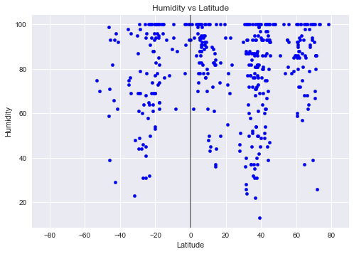
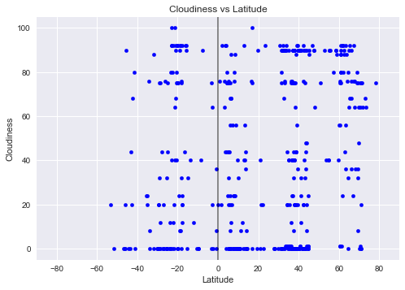
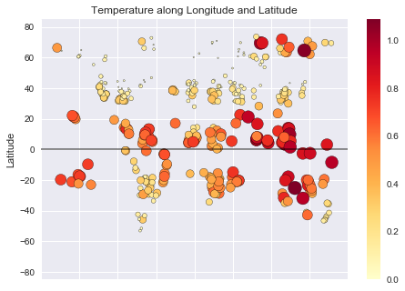

# Weather analysis - Approaching Equator

Data's true power lies in its ability to answer questions definitively. In this project, we are going to answer a fundamental question: "What's the weather like as we approach the equator?"

Now, we all might think, "Duh. It gets hotter..."

But let's try and prove it.

NOTE: This project takes into account only the weather info from one particular day. This can be viewed as a proof as concept


```python
#Import Dependencies
from config import api_keys
from citipy import citipy

import random
import requests

import pandas as pd
import numpy as np

import matplotlib.pyplot as plt

import matplotlib

# Set style for plots
plt.style.use("seaborn")
```

## Choosing representative sample set


```python
# For the selected coordinates, use citipy to associate them with nearest city.

cities_df["Closest City name"] = ""
cities_df["Closest Country code"] = ""
for index,row in cities_df.iterrows():
    city = citipy.nearest_city(row["Latitude"],row["Longitude"])
    cities_df.set_value(index,"Closest City name",city.city_name)
    cities_df.set_value(index,"Closest Country code",city.country_code)

```


```python
# Dropping random lat and lon samples from dataframe as they are not the exact coordinates for the cities.

clean_cities_df = cities_df.drop(['Latitude', 'Longitude'],axis=1)
clean_cities_df

# Dropping duplicate cities which may have resulted in the previous step
clean_cities_df = clean_cities_df.drop_duplicates()

clean_cities_df.shape


```


    (874, 2)


```python

# Picking a sample of 500 cities to proceed with analysis
selected_cities = clean_cities_df.sample(500)

selected_cities = selected_cities.reset_index(drop=True)

```

## Fetch City Weather info - OpenWeatherMap 


```python
# Setting up values for OpenWeatherMap API calls
base_url = "http://api.openweathermap.org/data/2.5/weather"

app_id = api_keys["open_weather_map_common"]

params = { "appid" :app_id,"units":"metric" }
```


```python
# SAMPLE JSON RESPONSE - 
#{"coord":{"lon":-0.13,"lat":51.51},
#"weather":[{"id":300,"main":"Drizzle","description":"light intensity drizzle","icon":"09d"}],
#"base":"stations",
#"main":{"temp":280.32,"pressure":1012,"humidity":81,"temp_min":279.15,"temp_max":281.15},
#"visibility":10000,
# "wind":{"speed":4.1,"deg":80},
# "clouds":{"all":90},
# "dt":1485789600,
# "sys":{"type":1,"id":5091,"message":0.0103,"country":"GB","sunrise":1485762037,"sunset":1485794875},
# "id":2643743,"name":"London","cod":200}

def encrypt_key(input_url):
    return input_url[0:53]+"<YourKey>"+input_url[85:]

for index,row in selected_cities.iterrows():
    params["q"] =f'{row["Closest City name"]},{row["Closest Country code"]}'
    print(f"Retrieving weather information for {params['q']}")
    city_weather_resp = requests.get(base_url,params)
    print(encrypt_key(city_weather_resp.url))
    city_weather_resp  = city_weather_resp.json()
    selected_cities.set_value(index,"Latitude",city_weather_resp.get("coord",{}).get("lat"))
    selected_cities.set_value(index,"Longitude",city_weather_resp.get("coord",{}).get("lon"))
    selected_cities.set_value(index,"Temperature",city_weather_resp.get("main",{}).get("temp_max"))
    selected_cities.set_value(index,"Wind speed",city_weather_resp.get("wind",{}).get("speed"))
    selected_cities.set_value(index,"Humidity",city_weather_resp.get("main",{}).get("humidity"))
    selected_cities.set_value(index,"Cloudiness",city_weather_resp.get("clouds",{}).get("all"))
    

```


```python
# Drop cities with missing information
selected_cities = selected_cities.dropna()

selected_cities.shape
selected_cities.to_csv("City_Weather_data.csv")
```

## Analysing Weather Features


```python
# Plot settings
def set_plot_prop(x_title,x_lim,y_title):
    plt.title(f"{y_title} vs {x_title}")
    plt.ylabel(y_title)
    plt.xlabel(x_title)
    plt.grid(True)
    plt.xlim(x_lim)
```

###   1. Temperature vs Latitude


```python
# Temperature vs Latitude 
selected_cities.plot(kind="scatter",x="Latitude",y="Temperature",grid=True,color="blue")
```


    <matplotlib.axes._subplots.AxesSubplot at 0x1c99f3195f8>


```python
set_plot_prop("Latitude",[-90,90],"Temperature (Celsius)")
plt.axvline(0, color='black',alpha=0.5)
plt.show()
```


#### Observation # 1 - Temperature is at it's peak around equator. This clearly shows that temperature increases as it approaches equator

###   2. Humidity vs Latitude


```python
# Humidity vs Latitude 

selected_cities.plot(kind="scatter",x="Latitude",y="Humidity",grid=True,color="blue")
```


    <matplotlib.axes._subplots.AxesSubplot at 0x1c99e70cd68>


```python
set_plot_prop("Latitude",[-90,90],"Humidity")
plt.axvline(0, color='black',alpha=0.5)
plt.show()
```





#### Observation # 2 - Humidity around Equator seems to be in the range on 25 - 100, which is pretty similar to parts far from Equator

###   3. Wind Speed vs Latitude 


```python
# Wind speed vs Latitude
selected_cities["Wind speed"] = pd.to_numeric(selected_cities["Wind speed"])
selected_cities.plot(kind="scatter",x="Latitude",y="Wind speed",grid=True,color="blue")
```


    <matplotlib.axes._subplots.AxesSubplot at 0x1c99e96d748>


```python
set_plot_prop("Latitude",[-90,90],"Wind speed (mph)")
plt.axvline(0, color='black',alpha=0.5)
plt.show()
```


#### Observation # 3 - Wind speed for most cities seem to fall under 10 mph. This is not different around equator

###   4. Cloudiness vs Latitude


```python
# Cloudiness vs Latitude
selected_cities["Cloudiness"] = pd.to_numeric(selected_cities["Cloudiness"])
selected_cities.plot(kind="scatter",x="Latitude",y="Cloudiness",grid=True,color="blue")
```


    <matplotlib.axes._subplots.AxesSubplot at 0x1c99ed01780>


```python
set_plot_prop("Latitude",[-90,90],"Cloudiness")
plt.axvline(0, color='black',alpha=0.5)
plt.show()
```





#### Observation # 4 - Cloudiness seems well spread out for this day. No correlation visible with latitude 

## Temperature approaching equator


```python
# Temperature approaching equator
size_temp = np.round((((selected_cities.Temperature)/100)**2)*10,2)

selected_cities.plot(kind="scatter",x="Longitude",y="Latitude",grid=True, edgecolor="black",
                     c=size_temp,s=200,cmap=plt.cm.YlOrRd)
plt.xlabel("Longitude")
plt.tight_layout()
plt.title("Temperature along Longitude and Latitude")
plt.ylabel("Latitude")
plt.ylim([-85,85])
plt.grid(True)

plt.xlim([-200,200])
plt.subplots_adjust(bottom=.25, left=.25)

plt.axhline(0, color='black',alpha=0.5)

plt.show()
```





### Conclusive Observation 

The Temperature along Latitude and Longitude chart clearly represents that the the zone around the equator line has most of the red points, which indicates hotter temperatures. So, we can come to a conclusion that temperature gets hotter as it approaches the equator.
