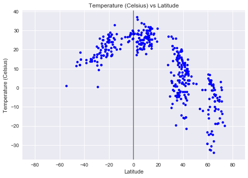
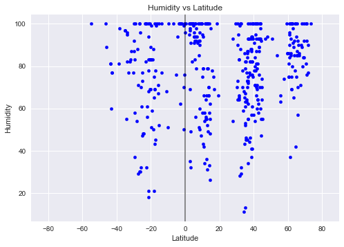
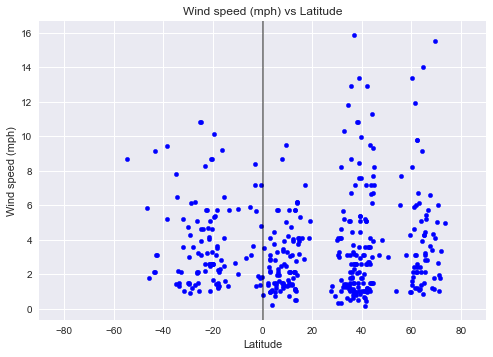
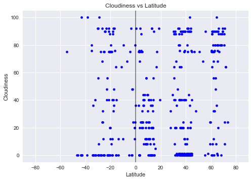
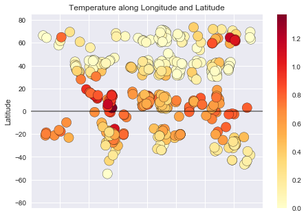

# Weather analysis - Approaching Equator

Data's true power lies in its ability to answer questions definitively. In this project, we are going to answer a fundamental question: "What's the weather like as we approach the equator?"

Now, we all might think, "Duh. It gets hotter..."

But let's try and prove it. 

Checkout the temperature and weather plots on map. 

https://sadhana1002.github.io/Weather-analysis-along-the-longitude/

NOTE: This project takes into account only the weather info from one particular day. This can be viewed as a proof as concept


```python
#Import Dependencies
from config import api_keys
from citipy import citipy

import random
import requests

import pandas as pd
import numpy as np

import matplotlib.pyplot as plt

import matplotlib

# Set style for plots
plt.style.use("seaborn")
```

## Choosing representative sample set


```python

# Getting a sample that is representative of the world cities.

# Set Lat & Lon Zones to randomly pick coordinates - So, we have some from each region.
lat_zone = np.arange(-90,90,15)
lon_zone = np.arange(-200,200,15)


# Creating a new data frame to hold randomly picked coordinates and corresponding city information
cities_df = pd.DataFrame()

cities_df["Latitude"] = ""
cities_df["Longitude"] = ""

# From each zone, randomly pick 50 unique coordinates and adding to the dataframe.
for x in lat_zone:
    for y in lon_zone:
        x_values = list(np.arange(x,x+15,0.01))
        y_values = list(np.arange(y,y+15,0.01))
        lats = random.sample(x_values,50)
        lons = random.sample(y_values,50)
        lat_samples = [(x+dec_lat) for dec_lat in lats]
        lon_samples = [y+dec_lon for dec_lon in lons]
        cities_df = cities_df.append(pd.DataFrame.from_dict({"Latitude":lat_samples,
                                       "Longitude":lon_samples}))
cities_df = cities_df.reset_index(drop=True)
cities_df.shape
```


    (16200, 2)


```python
# For the selected coordinates, use citipy to associate them with nearest city.

cities_df["Closest City name"] = ""
cities_df["Closest Country code"] = ""
for index,row in cities_df.iterrows():
    city = citipy.nearest_city(row["Latitude"],row["Longitude"])
    cities_df.set_value(index,"Closest City name",city.city_name)
    cities_df.set_value(index,"Closest Country code",city.country_code)

```


```python
# Dropping random lat and lon samples from dataframe as they are not the exact coordinates for the cities.

clean_cities_df = cities_df.drop(['Latitude', 'Longitude'],axis=1)
clean_cities_df

# Dropping duplicate cities which may have resulted in the previous step
clean_cities_df = clean_cities_df.drop_duplicates()

clean_cities_df.shape


```


    (860, 2)


```python

# Picking a sample of 500 cities to proceed with analysis
selected_cities = clean_cities_df.sample(500)

selected_cities = selected_cities.reset_index(drop=True)

```

## Fetch City Weather info - OpenWeatherMap 


```python
# Setting up values for OpenWeatherMap API calls
base_url = "http://api.openweathermap.org/data/2.5/weather"

app_id = api_keys["open_weather_map_common"]

params = { "appid" :app_id,"units":"metric" }
```


```python
# SAMPLE JSON RESPONSE - 
#{"coord":{"lon":-0.13,"lat":51.51},
#"weather":[{"id":300,"main":"Drizzle","description":"light intensity drizzle","icon":"09d"}],
#"base":"stations",
#"main":{"temp":280.32,"pressure":1012,"humidity":81,"temp_min":279.15,"temp_max":281.15},
#"visibility":10000,
# "wind":{"speed":4.1,"deg":80},
# "clouds":{"all":90},
# "dt":1485789600,
# "sys":{"type":1,"id":5091,"message":0.0103,"country":"GB","sunrise":1485762037,"sunset":1485794875},
# "id":2643743,"name":"London","cod":200}

def encrypt_key(input_url):
    return input_url[0:53]+"<YourKey>"+input_url[85:]

for index,row in selected_cities.iterrows():
    params["q"] =f'{row["Closest City name"]},{row["Closest Country code"]}'
    print(f"Retrieving weather information for {params['q']}")
    city_weather_resp = requests.get(base_url,params)
    print(encrypt_key(city_weather_resp.url))
    city_weather_resp  = city_weather_resp.json()
    selected_cities.set_value(index,"Latitude",city_weather_resp.get("coord",{}).get("lat"))
    selected_cities.set_value(index,"Longitude",city_weather_resp.get("coord",{}).get("lon"))
    selected_cities.set_value(index,"Temperature",city_weather_resp.get("main",{}).get("temp_max"))
    selected_cities.set_value(index,"Wind speed",city_weather_resp.get("wind",{}).get("speed"))
    selected_cities.set_value(index,"Humidity",city_weather_resp.get("main",{}).get("humidity"))
    selected_cities.set_value(index,"Cloudiness",city_weather_resp.get("clouds",{}).get("all"))
    

```

    Retrieving weather information for suluq,ly
    http://api.openweathermap.org/data/2.5/weather?appid=<YourKey>&units=metric&q=suluq%2Cly
    Retrieving weather information for ardistan,ir
    http://api.openweathermap.org/data/2.5/weather?appid=<YourKey>&units=metric&q=ardistan%2Cir
    Retrieving weather information for kysyl-syr,ru
    http://api.openweathermap.org/data/2.5/weather?appid=<YourKey>&units=metric&q=kysyl-syr%2Cru
    Retrieving weather information for burica,pa
    http://api.openweathermap.org/data/2.5/weather?appid=<YourKey>&units=metric&q=burica%2Cpa
    Retrieving weather information for thinadhoo,mv
    http://api.openweathermap.org/data/2.5/weather?appid=<YourKey>&units=metric&q=thinadhoo%2Cmv
    Retrieving weather information for pacific grove,us
    http://api.openweathermap.org/data/2.5/weather?appid=<YourKey>&units=metric&q=pacific+grove%2Cus
    Retrieving weather information for rungata,ki
    http://api.openweathermap.org/data/2.5/weather?appid=<YourKey>&units=metric&q=rungata%2Cki
    Retrieving weather information for damietta,eg
    http://api.openweathermap.org/data/2.5/weather?appid=<YourKey>&units=metric&q=damietta%2Ceg
    Retrieving weather information for tarrega,es
    http://api.openweathermap.org/data/2.5/weather?appid=<YourKey>&units=metric&q=tarrega%2Ces
    Retrieving weather information for copiapo,cl
    http://api.openweathermap.org/data/2.5/weather?appid=<YourKey>&units=metric&q=copiapo%2Ccl
    Retrieving weather information for riviere des anguilles,mu
    http://api.openweathermap.org/data/2.5/weather?appid=<YourKey>&units=metric&q=riviere+des+anguilles%2Cmu
    Retrieving weather information for babanusah,sd
    http://api.openweathermap.org/data/2.5/weather?appid=<YourKey>&units=metric&q=babanusah%2Csd
    Retrieving weather information for grafton,au
    http://api.openweathermap.org/data/2.5/weather?appid=<YourKey>&units=metric&q=grafton%2Cau
    Retrieving weather information for linhares,br
    http://api.openweathermap.org/data/2.5/weather?appid=<YourKey>&units=metric&q=linhares%2Cbr
    Retrieving weather information for hohhot,cn
    http://api.openweathermap.org/data/2.5/weather?appid=<YourKey>&units=metric&q=hohhot%2Ccn
    Retrieving weather information for twentynine palms,us
    http://api.openweathermap.org/data/2.5/weather?appid=<YourKey>&units=metric&q=twentynine+palms%2Cus
    Retrieving weather information for mys shmidta,ru
    http://api.openweathermap.org/data/2.5/weather?appid=<YourKey>&units=metric&q=mys+shmidta%2Cru
    Retrieving weather information for zwedru,lr
    http://api.openweathermap.org/data/2.5/weather?appid=<YourKey>&units=metric&q=zwedru%2Clr
    Retrieving weather information for suntar,ru
    http://api.openweathermap.org/data/2.5/weather?appid=<YourKey>&units=metric&q=suntar%2Cru
    Retrieving weather information for charagua,bo
    http://api.openweathermap.org/data/2.5/weather?appid=<YourKey>&units=metric&q=charagua%2Cbo
    Retrieving weather information for furano,jp
    http://api.openweathermap.org/data/2.5/weather?appid=<YourKey>&units=metric&q=furano%2Cjp
    Retrieving weather information for mogapi,bw
    http://api.openweathermap.org/data/2.5/weather?appid=<YourKey>&units=metric&q=mogapi%2Cbw
    Retrieving weather information for buta,cd
    http://api.openweathermap.org/data/2.5/weather?appid=<YourKey>&units=metric&q=buta%2Ccd
    Retrieving weather information for port said,eg
    http://api.openweathermap.org/data/2.5/weather?appid=<YourKey>&units=metric&q=port+said%2Ceg
    Retrieving weather information for xinzhi,cn
    http://api.openweathermap.org/data/2.5/weather?appid=<YourKey>&units=metric&q=xinzhi%2Ccn
    Retrieving weather information for bathsheba,bb
    http://api.openweathermap.org/data/2.5/weather?appid=<YourKey>&units=metric&q=bathsheba%2Cbb
    Retrieving weather information for illoqqortoormiut,gl
    http://api.openweathermap.org/data/2.5/weather?appid=<YourKey>&units=metric&q=illoqqortoormiut%2Cgl
    Retrieving weather information for newport,us
    http://api.openweathermap.org/data/2.5/weather?appid=<YourKey>&units=metric&q=newport%2Cus
    Retrieving weather information for mehamn,no
    http://api.openweathermap.org/data/2.5/weather?appid=<YourKey>&units=metric&q=mehamn%2Cno
    Retrieving weather information for kande,tg
    http://api.openweathermap.org/data/2.5/weather?appid=<YourKey>&units=metric&q=kande%2Ctg
    Retrieving weather information for hualmay,pe
    http://api.openweathermap.org/data/2.5/weather?appid=<YourKey>&units=metric&q=hualmay%2Cpe
    Retrieving weather information for yeppoon,au
    http://api.openweathermap.org/data/2.5/weather?appid=<YourKey>&units=metric&q=yeppoon%2Cau
    Retrieving weather information for biltine,td
    http://api.openweathermap.org/data/2.5/weather?appid=<YourKey>&units=metric&q=biltine%2Ctd
    Retrieving weather information for santa filomena,ph
    http://api.openweathermap.org/data/2.5/weather?appid=<YourKey>&units=metric&q=santa+filomena%2Cph
    Retrieving weather information for jiaozuo,cn
    http://api.openweathermap.org/data/2.5/weather?appid=<YourKey>&units=metric&q=jiaozuo%2Ccn
    Retrieving weather information for klaksvik,fo
    http://api.openweathermap.org/data/2.5/weather?appid=<YourKey>&units=metric&q=klaksvik%2Cfo
    Retrieving weather information for eyl,so
    http://api.openweathermap.org/data/2.5/weather?appid=<YourKey>&units=metric&q=eyl%2Cso
    Retrieving weather information for barcelos,br
    http://api.openweathermap.org/data/2.5/weather?appid=<YourKey>&units=metric&q=barcelos%2Cbr
    Retrieving weather information for sanmenxia,cn
    http://api.openweathermap.org/data/2.5/weather?appid=<YourKey>&units=metric&q=sanmenxia%2Ccn
    Retrieving weather information for rafai,cf
    http://api.openweathermap.org/data/2.5/weather?appid=<YourKey>&units=metric&q=rafai%2Ccf
    Retrieving weather information for oistins,bb
    http://api.openweathermap.org/data/2.5/weather?appid=<YourKey>&units=metric&q=oistins%2Cbb
    Retrieving weather information for gympie,au
    http://api.openweathermap.org/data/2.5/weather?appid=<YourKey>&units=metric&q=gympie%2Cau
    Retrieving weather information for cap malheureux,mu
    http://api.openweathermap.org/data/2.5/weather?appid=<YourKey>&units=metric&q=cap+malheureux%2Cmu
    Retrieving weather information for san pedro,ar
    http://api.openweathermap.org/data/2.5/weather?appid=<YourKey>&units=metric&q=san+pedro%2Car
    Retrieving weather information for albany,au
    http://api.openweathermap.org/data/2.5/weather?appid=<YourKey>&units=metric&q=albany%2Cau
    Retrieving weather information for puerto ayora,ec
    http://api.openweathermap.org/data/2.5/weather?appid=<YourKey>&units=metric&q=puerto+ayora%2Cec
    Retrieving weather information for baza,es
    http://api.openweathermap.org/data/2.5/weather?appid=<YourKey>&units=metric&q=baza%2Ces
    Retrieving weather information for general higinio morinigo,py
    http://api.openweathermap.org/data/2.5/weather?appid=<YourKey>&units=metric&q=general+higinio+morinigo%2Cpy
    Retrieving weather information for ejura,gh
    http://api.openweathermap.org/data/2.5/weather?appid=<YourKey>&units=metric&q=ejura%2Cgh
    Retrieving weather information for yukon,us
    http://api.openweathermap.org/data/2.5/weather?appid=<YourKey>&units=metric&q=yukon%2Cus
    Retrieving weather information for rocha,uy
    http://api.openweathermap.org/data/2.5/weather?appid=<YourKey>&units=metric&q=rocha%2Cuy
    Retrieving weather information for hay river,ca
    http://api.openweathermap.org/data/2.5/weather?appid=<YourKey>&units=metric&q=hay+river%2Cca
    Retrieving weather information for berlevag,no
    http://api.openweathermap.org/data/2.5/weather?appid=<YourKey>&units=metric&q=berlevag%2Cno
    Retrieving weather information for shenxian,cn
    http://api.openweathermap.org/data/2.5/weather?appid=<YourKey>&units=metric&q=shenxian%2Ccn
    Retrieving weather information for hwange,zw
    http://api.openweathermap.org/data/2.5/weather?appid=<YourKey>&units=metric&q=hwange%2Czw
    Retrieving weather information for pelym,ru
    http://api.openweathermap.org/data/2.5/weather?appid=<YourKey>&units=metric&q=pelym%2Cru
    Retrieving weather information for carroll,us
    http://api.openweathermap.org/data/2.5/weather?appid=<YourKey>&units=metric&q=carroll%2Cus
    Retrieving weather information for corinto,ni
    http://api.openweathermap.org/data/2.5/weather?appid=<YourKey>&units=metric&q=corinto%2Cni
    Retrieving weather information for half moon bay,us
    http://api.openweathermap.org/data/2.5/weather?appid=<YourKey>&units=metric&q=half+moon+bay%2Cus
    Retrieving weather information for huron,us
    http://api.openweathermap.org/data/2.5/weather?appid=<YourKey>&units=metric&q=huron%2Cus
    Retrieving weather information for kavieng,pg
    http://api.openweathermap.org/data/2.5/weather?appid=<YourKey>&units=metric&q=kavieng%2Cpg
    Retrieving weather information for kalomo,zm
    http://api.openweathermap.org/data/2.5/weather?appid=<YourKey>&units=metric&q=kalomo%2Czm
    Retrieving weather information for shizunai,jp
    http://api.openweathermap.org/data/2.5/weather?appid=<YourKey>&units=metric&q=shizunai%2Cjp
    Retrieving weather information for port elizabeth,za
    http://api.openweathermap.org/data/2.5/weather?appid=<YourKey>&units=metric&q=port+elizabeth%2Cza
    Retrieving weather information for dubbo,au
    http://api.openweathermap.org/data/2.5/weather?appid=<YourKey>&units=metric&q=dubbo%2Cau
    Retrieving weather information for katima mulilo,na
    http://api.openweathermap.org/data/2.5/weather?appid=<YourKey>&units=metric&q=katima+mulilo%2Cna
    Retrieving weather information for bonfim,br
    http://api.openweathermap.org/data/2.5/weather?appid=<YourKey>&units=metric&q=bonfim%2Cbr
    Retrieving weather information for marrakesh,ma
    http://api.openweathermap.org/data/2.5/weather?appid=<YourKey>&units=metric&q=marrakesh%2Cma
    Retrieving weather information for gloria,ph
    http://api.openweathermap.org/data/2.5/weather?appid=<YourKey>&units=metric&q=gloria%2Cph
    Retrieving weather information for egvekinot,ru
    http://api.openweathermap.org/data/2.5/weather?appid=<YourKey>&units=metric&q=egvekinot%2Cru
    Retrieving weather information for gazanjyk,tm
    http://api.openweathermap.org/data/2.5/weather?appid=<YourKey>&units=metric&q=gazanjyk%2Ctm
    Retrieving weather information for vihti,fi
    http://api.openweathermap.org/data/2.5/weather?appid=<YourKey>&units=metric&q=vihti%2Cfi
    Retrieving weather information for amderma,ru
    http://api.openweathermap.org/data/2.5/weather?appid=<YourKey>&units=metric&q=amderma%2Cru
    Retrieving weather information for guatire,ve
    http://api.openweathermap.org/data/2.5/weather?appid=<YourKey>&units=metric&q=guatire%2Cve
    Retrieving weather information for kotido,ug
    http://api.openweathermap.org/data/2.5/weather?appid=<YourKey>&units=metric&q=kotido%2Cug
    Retrieving weather information for bokspits,bw
    http://api.openweathermap.org/data/2.5/weather?appid=<YourKey>&units=metric&q=bokspits%2Cbw
    Retrieving weather information for sheboygan,us
    http://api.openweathermap.org/data/2.5/weather?appid=<YourKey>&units=metric&q=sheboygan%2Cus
    Retrieving weather information for qui nhon,vn
    http://api.openweathermap.org/data/2.5/weather?appid=<YourKey>&units=metric&q=qui+nhon%2Cvn
    Retrieving weather information for zhuanghe,cn
    http://api.openweathermap.org/data/2.5/weather?appid=<YourKey>&units=metric&q=zhuanghe%2Ccn
    Retrieving weather information for niamey,ne
    http://api.openweathermap.org/data/2.5/weather?appid=<YourKey>&units=metric&q=niamey%2Cne
    Retrieving weather information for anqing,cn
    http://api.openweathermap.org/data/2.5/weather?appid=<YourKey>&units=metric&q=anqing%2Ccn
    Retrieving weather information for zemio,cf
    http://api.openweathermap.org/data/2.5/weather?appid=<YourKey>&units=metric&q=zemio%2Ccf
    Retrieving weather information for palu,id
    http://api.openweathermap.org/data/2.5/weather?appid=<YourKey>&units=metric&q=palu%2Cid
    Retrieving weather information for chimore,bo
    http://api.openweathermap.org/data/2.5/weather?appid=<YourKey>&units=metric&q=chimore%2Cbo
    Retrieving weather information for bentiu,sd
    http://api.openweathermap.org/data/2.5/weather?appid=<YourKey>&units=metric&q=bentiu%2Csd
    Retrieving weather information for poplar bluff,us
    http://api.openweathermap.org/data/2.5/weather?appid=<YourKey>&units=metric&q=poplar+bluff%2Cus
    Retrieving weather information for grimari,cf
    http://api.openweathermap.org/data/2.5/weather?appid=<YourKey>&units=metric&q=grimari%2Ccf
    Retrieving weather information for rikitea,pf
    http://api.openweathermap.org/data/2.5/weather?appid=<YourKey>&units=metric&q=rikitea%2Cpf
    Retrieving weather information for am timan,td
    http://api.openweathermap.org/data/2.5/weather?appid=<YourKey>&units=metric&q=am+timan%2Ctd
    Retrieving weather information for hobart,au
    http://api.openweathermap.org/data/2.5/weather?appid=<YourKey>&units=metric&q=hobart%2Cau
    Retrieving weather information for banda aceh,id
    http://api.openweathermap.org/data/2.5/weather?appid=<YourKey>&units=metric&q=banda+aceh%2Cid
    Retrieving weather information for guarapari,br
    http://api.openweathermap.org/data/2.5/weather?appid=<YourKey>&units=metric&q=guarapari%2Cbr
    Retrieving weather information for lincoln,nz
    http://api.openweathermap.org/data/2.5/weather?appid=<YourKey>&units=metric&q=lincoln%2Cnz
    Retrieving weather information for hofn,is
    http://api.openweathermap.org/data/2.5/weather?appid=<YourKey>&units=metric&q=hofn%2Cis
    Retrieving weather information for mujiayingzi,cn
    http://api.openweathermap.org/data/2.5/weather?appid=<YourKey>&units=metric&q=mujiayingzi%2Ccn
    Retrieving weather information for sotouboua,tg
    http://api.openweathermap.org/data/2.5/weather?appid=<YourKey>&units=metric&q=sotouboua%2Ctg
    Retrieving weather information for medea,dz
    http://api.openweathermap.org/data/2.5/weather?appid=<YourKey>&units=metric&q=medea%2Cdz
    Retrieving weather information for tasiilaq,gl
    http://api.openweathermap.org/data/2.5/weather?appid=<YourKey>&units=metric&q=tasiilaq%2Cgl
    Retrieving weather information for broome,au
    http://api.openweathermap.org/data/2.5/weather?appid=<YourKey>&units=metric&q=broome%2Cau
    Retrieving weather information for troy,us
    http://api.openweathermap.org/data/2.5/weather?appid=<YourKey>&units=metric&q=troy%2Cus
    Retrieving weather information for chuzhou,cn
    http://api.openweathermap.org/data/2.5/weather?appid=<YourKey>&units=metric&q=chuzhou%2Ccn
    Retrieving weather information for cabra,ph
    http://api.openweathermap.org/data/2.5/weather?appid=<YourKey>&units=metric&q=cabra%2Cph
    Retrieving weather information for outram,nz
    http://api.openweathermap.org/data/2.5/weather?appid=<YourKey>&units=metric&q=outram%2Cnz
    Retrieving weather information for ciudad guayana,ve
    http://api.openweathermap.org/data/2.5/weather?appid=<YourKey>&units=metric&q=ciudad+guayana%2Cve
    Retrieving weather information for cidreira,br
    http://api.openweathermap.org/data/2.5/weather?appid=<YourKey>&units=metric&q=cidreira%2Cbr
    Retrieving weather information for kumluca,tr
    http://api.openweathermap.org/data/2.5/weather?appid=<YourKey>&units=metric&q=kumluca%2Ctr
    Retrieving weather information for tiksi,ru
    http://api.openweathermap.org/data/2.5/weather?appid=<YourKey>&units=metric&q=tiksi%2Cru
    Retrieving weather information for maryville,us
    http://api.openweathermap.org/data/2.5/weather?appid=<YourKey>&units=metric&q=maryville%2Cus
    Retrieving weather information for sabla,bg
    http://api.openweathermap.org/data/2.5/weather?appid=<YourKey>&units=metric&q=sabla%2Cbg
    Retrieving weather information for senekal,za
    http://api.openweathermap.org/data/2.5/weather?appid=<YourKey>&units=metric&q=senekal%2Cza
    Retrieving weather information for kutum,sd
    http://api.openweathermap.org/data/2.5/weather?appid=<YourKey>&units=metric&q=kutum%2Csd
    Retrieving weather information for koroni,gr
    http://api.openweathermap.org/data/2.5/weather?appid=<YourKey>&units=metric&q=koroni%2Cgr
    Retrieving weather information for shihezi,cn
    http://api.openweathermap.org/data/2.5/weather?appid=<YourKey>&units=metric&q=shihezi%2Ccn
    Retrieving weather information for le vauclin,mq
    http://api.openweathermap.org/data/2.5/weather?appid=<YourKey>&units=metric&q=le+vauclin%2Cmq
    Retrieving weather information for roald,no
    http://api.openweathermap.org/data/2.5/weather?appid=<YourKey>&units=metric&q=roald%2Cno
    Retrieving weather information for hami,cn
    http://api.openweathermap.org/data/2.5/weather?appid=<YourKey>&units=metric&q=hami%2Ccn
    Retrieving weather information for beringovskiy,ru
    http://api.openweathermap.org/data/2.5/weather?appid=<YourKey>&units=metric&q=beringovskiy%2Cru
    Retrieving weather information for almaznyy,ru
    http://api.openweathermap.org/data/2.5/weather?appid=<YourKey>&units=metric&q=almaznyy%2Cru
    Retrieving weather information for cotonou,bj
    http://api.openweathermap.org/data/2.5/weather?appid=<YourKey>&units=metric&q=cotonou%2Cbj
    Retrieving weather information for belushya guba,ru
    http://api.openweathermap.org/data/2.5/weather?appid=<YourKey>&units=metric&q=belushya+guba%2Cru
    Retrieving weather information for tolaga bay,nz
    http://api.openweathermap.org/data/2.5/weather?appid=<YourKey>&units=metric&q=tolaga+bay%2Cnz
    Retrieving weather information for pingdingshan,cn
    http://api.openweathermap.org/data/2.5/weather?appid=<YourKey>&units=metric&q=pingdingshan%2Ccn
    Retrieving weather information for itarema,br
    http://api.openweathermap.org/data/2.5/weather?appid=<YourKey>&units=metric&q=itarema%2Cbr
    Retrieving weather information for santa eulalia del rio,es
    http://api.openweathermap.org/data/2.5/weather?appid=<YourKey>&units=metric&q=santa+eulalia+del+rio%2Ces
    Retrieving weather information for barstow,us
    http://api.openweathermap.org/data/2.5/weather?appid=<YourKey>&units=metric&q=barstow%2Cus
    Retrieving weather information for salta,ar
    http://api.openweathermap.org/data/2.5/weather?appid=<YourKey>&units=metric&q=salta%2Car
    Retrieving weather information for bougouni,ml
    http://api.openweathermap.org/data/2.5/weather?appid=<YourKey>&units=metric&q=bougouni%2Cml
    Retrieving weather information for tandalti,sd
    http://api.openweathermap.org/data/2.5/weather?appid=<YourKey>&units=metric&q=tandalti%2Csd
    Retrieving weather information for lagoa,pt
    http://api.openweathermap.org/data/2.5/weather?appid=<YourKey>&units=metric&q=lagoa%2Cpt
    Retrieving weather information for touros,br
    http://api.openweathermap.org/data/2.5/weather?appid=<YourKey>&units=metric&q=touros%2Cbr
    Retrieving weather information for carcassonne,fr
    http://api.openweathermap.org/data/2.5/weather?appid=<YourKey>&units=metric&q=carcassonne%2Cfr
    Retrieving weather information for anamur,tr
    http://api.openweathermap.org/data/2.5/weather?appid=<YourKey>&units=metric&q=anamur%2Ctr
    Retrieving weather information for juegang,cn
    http://api.openweathermap.org/data/2.5/weather?appid=<YourKey>&units=metric&q=juegang%2Ccn
    Retrieving weather information for warqla,dz
    http://api.openweathermap.org/data/2.5/weather?appid=<YourKey>&units=metric&q=warqla%2Cdz
    Retrieving weather information for claveria,ph
    http://api.openweathermap.org/data/2.5/weather?appid=<YourKey>&units=metric&q=claveria%2Cph
    Retrieving weather information for port blair,in
    http://api.openweathermap.org/data/2.5/weather?appid=<YourKey>&units=metric&q=port+blair%2Cin
    Retrieving weather information for perivolion,gr
    http://api.openweathermap.org/data/2.5/weather?appid=<YourKey>&units=metric&q=perivolion%2Cgr
    Retrieving weather information for kukes,al
    http://api.openweathermap.org/data/2.5/weather?appid=<YourKey>&units=metric&q=kukes%2Cal
    Retrieving weather information for orahovac,rs
    http://api.openweathermap.org/data/2.5/weather?appid=<YourKey>&units=metric&q=orahovac%2Crs
    Retrieving weather information for belaya gora,ru
    http://api.openweathermap.org/data/2.5/weather?appid=<YourKey>&units=metric&q=belaya+gora%2Cru
    Retrieving weather information for oviedo,es
    http://api.openweathermap.org/data/2.5/weather?appid=<YourKey>&units=metric&q=oviedo%2Ces
    Retrieving weather information for dunedin,nz
    http://api.openweathermap.org/data/2.5/weather?appid=<YourKey>&units=metric&q=dunedin%2Cnz
    Retrieving weather information for namwala,zm
    http://api.openweathermap.org/data/2.5/weather?appid=<YourKey>&units=metric&q=namwala%2Czm
    Retrieving weather information for ofunato,jp
    http://api.openweathermap.org/data/2.5/weather?appid=<YourKey>&units=metric&q=ofunato%2Cjp
    Retrieving weather information for new norfolk,au
    http://api.openweathermap.org/data/2.5/weather?appid=<YourKey>&units=metric&q=new+norfolk%2Cau
    Retrieving weather information for resistencia,ar
    http://api.openweathermap.org/data/2.5/weather?appid=<YourKey>&units=metric&q=resistencia%2Car
    Retrieving weather information for luan,cn
    http://api.openweathermap.org/data/2.5/weather?appid=<YourKey>&units=metric&q=luan%2Ccn
    Retrieving weather information for lodwar,ke
    http://api.openweathermap.org/data/2.5/weather?appid=<YourKey>&units=metric&q=lodwar%2Cke
    Retrieving weather information for la cruz,cr
    http://api.openweathermap.org/data/2.5/weather?appid=<YourKey>&units=metric&q=la+cruz%2Ccr
    Retrieving weather information for zarautz,es
    http://api.openweathermap.org/data/2.5/weather?appid=<YourKey>&units=metric&q=zarautz%2Ces
    Retrieving weather information for santa fe,ph
    http://api.openweathermap.org/data/2.5/weather?appid=<YourKey>&units=metric&q=santa+fe%2Cph
    Retrieving weather information for butaritari,ki
    http://api.openweathermap.org/data/2.5/weather?appid=<YourKey>&units=metric&q=butaritari%2Cki
    Retrieving weather information for saint paul,us
    http://api.openweathermap.org/data/2.5/weather?appid=<YourKey>&units=metric&q=saint+paul%2Cus
    Retrieving weather information for cantaura,ve
    http://api.openweathermap.org/data/2.5/weather?appid=<YourKey>&units=metric&q=cantaura%2Cve
    Retrieving weather information for san patricio,mx
    http://api.openweathermap.org/data/2.5/weather?appid=<YourKey>&units=metric&q=san+patricio%2Cmx
    Retrieving weather information for kriel,za
    http://api.openweathermap.org/data/2.5/weather?appid=<YourKey>&units=metric&q=kriel%2Cza
    Retrieving weather information for kauhajoki,fi
    http://api.openweathermap.org/data/2.5/weather?appid=<YourKey>&units=metric&q=kauhajoki%2Cfi
    Retrieving weather information for kodiak,us
    http://api.openweathermap.org/data/2.5/weather?appid=<YourKey>&units=metric&q=kodiak%2Cus
    Retrieving weather information for santa isabel do rio negro,br
    http://api.openweathermap.org/data/2.5/weather?appid=<YourKey>&units=metric&q=santa+isabel+do+rio+negro%2Cbr
    Retrieving weather information for souillac,mu
    http://api.openweathermap.org/data/2.5/weather?appid=<YourKey>&units=metric&q=souillac%2Cmu
    Retrieving weather information for ballina,au
    http://api.openweathermap.org/data/2.5/weather?appid=<YourKey>&units=metric&q=ballina%2Cau
    Retrieving weather information for yulara,au
    http://api.openweathermap.org/data/2.5/weather?appid=<YourKey>&units=metric&q=yulara%2Cau
    Retrieving weather information for bria,cf
    http://api.openweathermap.org/data/2.5/weather?appid=<YourKey>&units=metric&q=bria%2Ccf
    Retrieving weather information for bontang,id
    http://api.openweathermap.org/data/2.5/weather?appid=<YourKey>&units=metric&q=bontang%2Cid
    Retrieving weather information for tabas,ir
    http://api.openweathermap.org/data/2.5/weather?appid=<YourKey>&units=metric&q=tabas%2Cir
    Retrieving weather information for umm jarr,sd
    http://api.openweathermap.org/data/2.5/weather?appid=<YourKey>&units=metric&q=umm+jarr%2Csd
    Retrieving weather information for vardo,no
    http://api.openweathermap.org/data/2.5/weather?appid=<YourKey>&units=metric&q=vardo%2Cno
    Retrieving weather information for botou,cn
    http://api.openweathermap.org/data/2.5/weather?appid=<YourKey>&units=metric&q=botou%2Ccn
    Retrieving weather information for bluff,nz
    http://api.openweathermap.org/data/2.5/weather?appid=<YourKey>&units=metric&q=bluff%2Cnz
    Retrieving weather information for leningradskiy,ru
    http://api.openweathermap.org/data/2.5/weather?appid=<YourKey>&units=metric&q=leningradskiy%2Cru
    Retrieving weather information for bafq,ir
    http://api.openweathermap.org/data/2.5/weather?appid=<YourKey>&units=metric&q=bafq%2Cir
    Retrieving weather information for luangwa,zm
    http://api.openweathermap.org/data/2.5/weather?appid=<YourKey>&units=metric&q=luangwa%2Czm
    Retrieving weather information for grand river south east,mu
    http://api.openweathermap.org/data/2.5/weather?appid=<YourKey>&units=metric&q=grand+river+south+east%2Cmu
    Retrieving weather information for vao,nc
    http://api.openweathermap.org/data/2.5/weather?appid=<YourKey>&units=metric&q=vao%2Cnc
    Retrieving weather information for ekangala,za
    http://api.openweathermap.org/data/2.5/weather?appid=<YourKey>&units=metric&q=ekangala%2Cza
    Retrieving weather information for jega,ng
    http://api.openweathermap.org/data/2.5/weather?appid=<YourKey>&units=metric&q=jega%2Cng
    Retrieving weather information for arica,cl
    http://api.openweathermap.org/data/2.5/weather?appid=<YourKey>&units=metric&q=arica%2Ccl
    Retrieving weather information for kilinochchi,lk
    http://api.openweathermap.org/data/2.5/weather?appid=<YourKey>&units=metric&q=kilinochchi%2Clk
    Retrieving weather information for muzhi,ru
    http://api.openweathermap.org/data/2.5/weather?appid=<YourKey>&units=metric&q=muzhi%2Cru
    Retrieving weather information for bethal,za
    http://api.openweathermap.org/data/2.5/weather?appid=<YourKey>&units=metric&q=bethal%2Cza
    Retrieving weather information for anadyr,ru
    http://api.openweathermap.org/data/2.5/weather?appid=<YourKey>&units=metric&q=anadyr%2Cru
    Retrieving weather information for beitbridge,zw
    http://api.openweathermap.org/data/2.5/weather?appid=<YourKey>&units=metric&q=beitbridge%2Czw
    Retrieving weather information for lieksa,fi
    http://api.openweathermap.org/data/2.5/weather?appid=<YourKey>&units=metric&q=lieksa%2Cfi
    Retrieving weather information for acoyapa,ni
    http://api.openweathermap.org/data/2.5/weather?appid=<YourKey>&units=metric&q=acoyapa%2Cni
    Retrieving weather information for huarmey,pe
    http://api.openweathermap.org/data/2.5/weather?appid=<YourKey>&units=metric&q=huarmey%2Cpe
    Retrieving weather information for ribeira grande,pt
    http://api.openweathermap.org/data/2.5/weather?appid=<YourKey>&units=metric&q=ribeira+grande%2Cpt
    Retrieving weather information for malamig,ph
    http://api.openweathermap.org/data/2.5/weather?appid=<YourKey>&units=metric&q=malamig%2Cph
    Retrieving weather information for ust-tsilma,ru
    http://api.openweathermap.org/data/2.5/weather?appid=<YourKey>&units=metric&q=ust-tsilma%2Cru
    Retrieving weather information for raga,sd
    http://api.openweathermap.org/data/2.5/weather?appid=<YourKey>&units=metric&q=raga%2Csd
    Retrieving weather information for pryazha,ru
    http://api.openweathermap.org/data/2.5/weather?appid=<YourKey>&units=metric&q=pryazha%2Cru
    Retrieving weather information for jasper,us
    http://api.openweathermap.org/data/2.5/weather?appid=<YourKey>&units=metric&q=jasper%2Cus
    Retrieving weather information for belyy yar,ru
    http://api.openweathermap.org/data/2.5/weather?appid=<YourKey>&units=metric&q=belyy+yar%2Cru
    Retrieving weather information for jumla,np
    http://api.openweathermap.org/data/2.5/weather?appid=<YourKey>&units=metric&q=jumla%2Cnp
    Retrieving weather information for kudahuvadhoo,mv
    http://api.openweathermap.org/data/2.5/weather?appid=<YourKey>&units=metric&q=kudahuvadhoo%2Cmv
    Retrieving weather information for kushiro,jp
    http://api.openweathermap.org/data/2.5/weather?appid=<YourKey>&units=metric&q=kushiro%2Cjp
    Retrieving weather information for chapada dos guimaraes,br
    http://api.openweathermap.org/data/2.5/weather?appid=<YourKey>&units=metric&q=chapada+dos+guimaraes%2Cbr
    Retrieving weather information for mahon,es
    http://api.openweathermap.org/data/2.5/weather?appid=<YourKey>&units=metric&q=mahon%2Ces
    Retrieving weather information for mahibadhoo,mv
    http://api.openweathermap.org/data/2.5/weather?appid=<YourKey>&units=metric&q=mahibadhoo%2Cmv
    Retrieving weather information for bintulu,my
    http://api.openweathermap.org/data/2.5/weather?appid=<YourKey>&units=metric&q=bintulu%2Cmy
    Retrieving weather information for trairi,br
    http://api.openweathermap.org/data/2.5/weather?appid=<YourKey>&units=metric&q=trairi%2Cbr
    Retrieving weather information for joshimath,in
    http://api.openweathermap.org/data/2.5/weather?appid=<YourKey>&units=metric&q=joshimath%2Cin
    Retrieving weather information for labuhan,id
    http://api.openweathermap.org/data/2.5/weather?appid=<YourKey>&units=metric&q=labuhan%2Cid
    Retrieving weather information for jimo,cn
    http://api.openweathermap.org/data/2.5/weather?appid=<YourKey>&units=metric&q=jimo%2Ccn
    Retrieving weather information for ladario,br
    http://api.openweathermap.org/data/2.5/weather?appid=<YourKey>&units=metric&q=ladario%2Cbr
    Retrieving weather information for shunyi,cn
    http://api.openweathermap.org/data/2.5/weather?appid=<YourKey>&units=metric&q=shunyi%2Ccn
    Retrieving weather information for izmir,tr
    http://api.openweathermap.org/data/2.5/weather?appid=<YourKey>&units=metric&q=izmir%2Ctr
    Retrieving weather information for alanya,tr
    http://api.openweathermap.org/data/2.5/weather?appid=<YourKey>&units=metric&q=alanya%2Ctr
    Retrieving weather information for semirom,ir
    http://api.openweathermap.org/data/2.5/weather?appid=<YourKey>&units=metric&q=semirom%2Cir
    Retrieving weather information for fortuna,us
    http://api.openweathermap.org/data/2.5/weather?appid=<YourKey>&units=metric&q=fortuna%2Cus
    Retrieving weather information for taft,us
    http://api.openweathermap.org/data/2.5/weather?appid=<YourKey>&units=metric&q=taft%2Cus
    Retrieving weather information for motril,es
    http://api.openweathermap.org/data/2.5/weather?appid=<YourKey>&units=metric&q=motril%2Ces
    Retrieving weather information for pingdu,cn
    http://api.openweathermap.org/data/2.5/weather?appid=<YourKey>&units=metric&q=pingdu%2Ccn
    Retrieving weather information for abu jubayhah,sd
    http://api.openweathermap.org/data/2.5/weather?appid=<YourKey>&units=metric&q=abu+jubayhah%2Csd
    Retrieving weather information for guerrero negro,mx
    http://api.openweathermap.org/data/2.5/weather?appid=<YourKey>&units=metric&q=guerrero+negro%2Cmx
    Retrieving weather information for halalo,wf
    http://api.openweathermap.org/data/2.5/weather?appid=<YourKey>&units=metric&q=halalo%2Cwf
    Retrieving weather information for tecoanapa,mx
    http://api.openweathermap.org/data/2.5/weather?appid=<YourKey>&units=metric&q=tecoanapa%2Cmx
    Retrieving weather information for roches noires,mu
    http://api.openweathermap.org/data/2.5/weather?appid=<YourKey>&units=metric&q=roches+noires%2Cmu
    Retrieving weather information for mikkeli,fi
    http://api.openweathermap.org/data/2.5/weather?appid=<YourKey>&units=metric&q=mikkeli%2Cfi
    Retrieving weather information for foso,gh
    http://api.openweathermap.org/data/2.5/weather?appid=<YourKey>&units=metric&q=foso%2Cgh
    Retrieving weather information for itaquyry,py
    http://api.openweathermap.org/data/2.5/weather?appid=<YourKey>&units=metric&q=itaquyry%2Cpy
    Retrieving weather information for comarapa,bo
    http://api.openweathermap.org/data/2.5/weather?appid=<YourKey>&units=metric&q=comarapa%2Cbo
    Retrieving weather information for pozo colorado,py
    http://api.openweathermap.org/data/2.5/weather?appid=<YourKey>&units=metric&q=pozo+colorado%2Cpy
    Retrieving weather information for neiafu,to
    http://api.openweathermap.org/data/2.5/weather?appid=<YourKey>&units=metric&q=neiafu%2Cto
    Retrieving weather information for huescar,es
    http://api.openweathermap.org/data/2.5/weather?appid=<YourKey>&units=metric&q=huescar%2Ces
    Retrieving weather information for sorkjosen,no
    http://api.openweathermap.org/data/2.5/weather?appid=<YourKey>&units=metric&q=sorkjosen%2Cno
    Retrieving weather information for huaiyin,cn
    http://api.openweathermap.org/data/2.5/weather?appid=<YourKey>&units=metric&q=huaiyin%2Ccn
    Retrieving weather information for coos bay,us
    http://api.openweathermap.org/data/2.5/weather?appid=<YourKey>&units=metric&q=coos+bay%2Cus
    Retrieving weather information for christchurch,nz
    http://api.openweathermap.org/data/2.5/weather?appid=<YourKey>&units=metric&q=christchurch%2Cnz
    Retrieving weather information for kamaishi,jp
    http://api.openweathermap.org/data/2.5/weather?appid=<YourKey>&units=metric&q=kamaishi%2Cjp
    Retrieving weather information for catamarca,ar
    http://api.openweathermap.org/data/2.5/weather?appid=<YourKey>&units=metric&q=catamarca%2Car
    Retrieving weather information for lorengau,pg
    http://api.openweathermap.org/data/2.5/weather?appid=<YourKey>&units=metric&q=lorengau%2Cpg
    Retrieving weather information for saint-pierre,pm
    http://api.openweathermap.org/data/2.5/weather?appid=<YourKey>&units=metric&q=saint-pierre%2Cpm
    Retrieving weather information for vieux fort,lc
    http://api.openweathermap.org/data/2.5/weather?appid=<YourKey>&units=metric&q=vieux+fort%2Clc
    Retrieving weather information for mahebourg,mu
    http://api.openweathermap.org/data/2.5/weather?appid=<YourKey>&units=metric&q=mahebourg%2Cmu
    Retrieving weather information for koulikoro,ml
    http://api.openweathermap.org/data/2.5/weather?appid=<YourKey>&units=metric&q=koulikoro%2Cml
    Retrieving weather information for poro,ph
    http://api.openweathermap.org/data/2.5/weather?appid=<YourKey>&units=metric&q=poro%2Cph
    Retrieving weather information for shancheng,cn
    http://api.openweathermap.org/data/2.5/weather?appid=<YourKey>&units=metric&q=shancheng%2Ccn
    Retrieving weather information for pisco,pe
    http://api.openweathermap.org/data/2.5/weather?appid=<YourKey>&units=metric&q=pisco%2Cpe
    Retrieving weather information for duzce,tr
    http://api.openweathermap.org/data/2.5/weather?appid=<YourKey>&units=metric&q=duzce%2Ctr
    Retrieving weather information for tuktoyaktuk,ca
    http://api.openweathermap.org/data/2.5/weather?appid=<YourKey>&units=metric&q=tuktoyaktuk%2Cca
    Retrieving weather information for lulea,se
    http://api.openweathermap.org/data/2.5/weather?appid=<YourKey>&units=metric&q=lulea%2Cse
    Retrieving weather information for halifax,ca
    http://api.openweathermap.org/data/2.5/weather?appid=<YourKey>&units=metric&q=halifax%2Cca
    Retrieving weather information for xuanzhou,cn
    http://api.openweathermap.org/data/2.5/weather?appid=<YourKey>&units=metric&q=xuanzhou%2Ccn
    Retrieving weather information for trinidad,bo
    http://api.openweathermap.org/data/2.5/weather?appid=<YourKey>&units=metric&q=trinidad%2Cbo
    Retrieving weather information for mayor pablo lagerenza,py
    http://api.openweathermap.org/data/2.5/weather?appid=<YourKey>&units=metric&q=mayor+pablo+lagerenza%2Cpy
    Retrieving weather information for crab hill,bb
    http://api.openweathermap.org/data/2.5/weather?appid=<YourKey>&units=metric&q=crab+hill%2Cbb
    Retrieving weather information for kozhva,ru
    http://api.openweathermap.org/data/2.5/weather?appid=<YourKey>&units=metric&q=kozhva%2Cru
    Retrieving weather information for broken hill,au
    http://api.openweathermap.org/data/2.5/weather?appid=<YourKey>&units=metric&q=broken+hill%2Cau
    Retrieving weather information for karauzyak,uz
    http://api.openweathermap.org/data/2.5/weather?appid=<YourKey>&units=metric&q=karauzyak%2Cuz
    Retrieving weather information for laurel,us
    http://api.openweathermap.org/data/2.5/weather?appid=<YourKey>&units=metric&q=laurel%2Cus
    Retrieving weather information for mizpe ramon,il
    http://api.openweathermap.org/data/2.5/weather?appid=<YourKey>&units=metric&q=mizpe+ramon%2Cil
    Retrieving weather information for vangaindrano,mg
    http://api.openweathermap.org/data/2.5/weather?appid=<YourKey>&units=metric&q=vangaindrano%2Cmg
    Retrieving weather information for sterling,us
    http://api.openweathermap.org/data/2.5/weather?appid=<YourKey>&units=metric&q=sterling%2Cus
    Retrieving weather information for moree,au
    http://api.openweathermap.org/data/2.5/weather?appid=<YourKey>&units=metric&q=moree%2Cau
    Retrieving weather information for borovoy,ru
    http://api.openweathermap.org/data/2.5/weather?appid=<YourKey>&units=metric&q=borovoy%2Cru
    Retrieving weather information for lensk,ru
    http://api.openweathermap.org/data/2.5/weather?appid=<YourKey>&units=metric&q=lensk%2Cru
    Retrieving weather information for lira,ug
    http://api.openweathermap.org/data/2.5/weather?appid=<YourKey>&units=metric&q=lira%2Cug
    Retrieving weather information for mokhotlong,ls
    http://api.openweathermap.org/data/2.5/weather?appid=<YourKey>&units=metric&q=mokhotlong%2Cls
    Retrieving weather information for boa vista,br
    http://api.openweathermap.org/data/2.5/weather?appid=<YourKey>&units=metric&q=boa+vista%2Cbr
    Retrieving weather information for tsihombe,mg
    http://api.openweathermap.org/data/2.5/weather?appid=<YourKey>&units=metric&q=tsihombe%2Cmg
    Retrieving weather information for figeac,fr
    http://api.openweathermap.org/data/2.5/weather?appid=<YourKey>&units=metric&q=figeac%2Cfr
    Retrieving weather information for macia,mz
    http://api.openweathermap.org/data/2.5/weather?appid=<YourKey>&units=metric&q=macia%2Cmz
    Retrieving weather information for champerico,gt
    http://api.openweathermap.org/data/2.5/weather?appid=<YourKey>&units=metric&q=champerico%2Cgt
    Retrieving weather information for snezhnogorsk,ru
    http://api.openweathermap.org/data/2.5/weather?appid=<YourKey>&units=metric&q=snezhnogorsk%2Cru
    Retrieving weather information for fayetteville,us
    http://api.openweathermap.org/data/2.5/weather?appid=<YourKey>&units=metric&q=fayetteville%2Cus
    Retrieving weather information for vaini,to
    http://api.openweathermap.org/data/2.5/weather?appid=<YourKey>&units=metric&q=vaini%2Cto
    Retrieving weather information for lovec,bg
    http://api.openweathermap.org/data/2.5/weather?appid=<YourKey>&units=metric&q=lovec%2Cbg
    Retrieving weather information for isiro,cd
    http://api.openweathermap.org/data/2.5/weather?appid=<YourKey>&units=metric&q=isiro%2Ccd
    Retrieving weather information for dandong,cn
    http://api.openweathermap.org/data/2.5/weather?appid=<YourKey>&units=metric&q=dandong%2Ccn
    Retrieving weather information for skalistyy,ru
    http://api.openweathermap.org/data/2.5/weather?appid=<YourKey>&units=metric&q=skalistyy%2Cru
    Retrieving weather information for miyako,jp
    http://api.openweathermap.org/data/2.5/weather?appid=<YourKey>&units=metric&q=miyako%2Cjp
    Retrieving weather information for vestmanna,fo
    http://api.openweathermap.org/data/2.5/weather?appid=<YourKey>&units=metric&q=vestmanna%2Cfo
    Retrieving weather information for podporozhye,ru
    http://api.openweathermap.org/data/2.5/weather?appid=<YourKey>&units=metric&q=podporozhye%2Cru
    Retrieving weather information for porto novo,cv
    http://api.openweathermap.org/data/2.5/weather?appid=<YourKey>&units=metric&q=porto+novo%2Ccv
    Retrieving weather information for upata,ve
    http://api.openweathermap.org/data/2.5/weather?appid=<YourKey>&units=metric&q=upata%2Cve
    Retrieving weather information for takahagi,jp
    http://api.openweathermap.org/data/2.5/weather?appid=<YourKey>&units=metric&q=takahagi%2Cjp
    Retrieving weather information for asfi,ma
    http://api.openweathermap.org/data/2.5/weather?appid=<YourKey>&units=metric&q=asfi%2Cma
    Retrieving weather information for olenegorsk,ru
    http://api.openweathermap.org/data/2.5/weather?appid=<YourKey>&units=metric&q=olenegorsk%2Cru
    Retrieving weather information for ayios andreas,gr
    http://api.openweathermap.org/data/2.5/weather?appid=<YourKey>&units=metric&q=ayios+andreas%2Cgr
    Retrieving weather information for rochester,us
    http://api.openweathermap.org/data/2.5/weather?appid=<YourKey>&units=metric&q=rochester%2Cus
    Retrieving weather information for prieska,za
    http://api.openweathermap.org/data/2.5/weather?appid=<YourKey>&units=metric&q=prieska%2Cza
    Retrieving weather information for soria,es
    http://api.openweathermap.org/data/2.5/weather?appid=<YourKey>&units=metric&q=soria%2Ces
    Retrieving weather information for kayerkan,ru
    http://api.openweathermap.org/data/2.5/weather?appid=<YourKey>&units=metric&q=kayerkan%2Cru
    Retrieving weather information for shakawe,bw
    http://api.openweathermap.org/data/2.5/weather?appid=<YourKey>&units=metric&q=shakawe%2Cbw
    Retrieving weather information for grand baie,mu
    http://api.openweathermap.org/data/2.5/weather?appid=<YourKey>&units=metric&q=grand+baie%2Cmu
    Retrieving weather information for abyek,ir
    http://api.openweathermap.org/data/2.5/weather?appid=<YourKey>&units=metric&q=abyek%2Cir
    Retrieving weather information for coquimbo,cl
    http://api.openweathermap.org/data/2.5/weather?appid=<YourKey>&units=metric&q=coquimbo%2Ccl
    Retrieving weather information for miri,my
    http://api.openweathermap.org/data/2.5/weather?appid=<YourKey>&units=metric&q=miri%2Cmy
    Retrieving weather information for sorvag,fo
    http://api.openweathermap.org/data/2.5/weather?appid=<YourKey>&units=metric&q=sorvag%2Cfo
    Retrieving weather information for bengkulu,id
    http://api.openweathermap.org/data/2.5/weather?appid=<YourKey>&units=metric&q=bengkulu%2Cid
    Retrieving weather information for birin,dz
    http://api.openweathermap.org/data/2.5/weather?appid=<YourKey>&units=metric&q=birin%2Cdz
    Retrieving weather information for montemor-o-novo,pt
    http://api.openweathermap.org/data/2.5/weather?appid=<YourKey>&units=metric&q=montemor-o-novo%2Cpt
    Retrieving weather information for tuban,ph
    http://api.openweathermap.org/data/2.5/weather?appid=<YourKey>&units=metric&q=tuban%2Cph
    Retrieving weather information for mananjary,mg
    http://api.openweathermap.org/data/2.5/weather?appid=<YourKey>&units=metric&q=mananjary%2Cmg
    Retrieving weather information for anuradhapura,lk
    http://api.openweathermap.org/data/2.5/weather?appid=<YourKey>&units=metric&q=anuradhapura%2Clk
    Retrieving weather information for nyurba,ru
    http://api.openweathermap.org/data/2.5/weather?appid=<YourKey>&units=metric&q=nyurba%2Cru
    Retrieving weather information for natchez,us
    http://api.openweathermap.org/data/2.5/weather?appid=<YourKey>&units=metric&q=natchez%2Cus
    Retrieving weather information for sao filipe,cv
    http://api.openweathermap.org/data/2.5/weather?appid=<YourKey>&units=metric&q=sao+filipe%2Ccv
    Retrieving weather information for harper,lr
    http://api.openweathermap.org/data/2.5/weather?appid=<YourKey>&units=metric&q=harper%2Clr
    Retrieving weather information for hays,us
    http://api.openweathermap.org/data/2.5/weather?appid=<YourKey>&units=metric&q=hays%2Cus
    Retrieving weather information for vagur,fo
    http://api.openweathermap.org/data/2.5/weather?appid=<YourKey>&units=metric&q=vagur%2Cfo
    Retrieving weather information for moron,ve
    http://api.openweathermap.org/data/2.5/weather?appid=<YourKey>&units=metric&q=moron%2Cve
    Retrieving weather information for chifeng,cn
    http://api.openweathermap.org/data/2.5/weather?appid=<YourKey>&units=metric&q=chifeng%2Ccn
    Retrieving weather information for vanimo,pg
    http://api.openweathermap.org/data/2.5/weather?appid=<YourKey>&units=metric&q=vanimo%2Cpg
    Retrieving weather information for rawson,ar
    http://api.openweathermap.org/data/2.5/weather?appid=<YourKey>&units=metric&q=rawson%2Car
    Retrieving weather information for dikson,ru
    http://api.openweathermap.org/data/2.5/weather?appid=<YourKey>&units=metric&q=dikson%2Cru
    Retrieving weather information for saldanha,za
    http://api.openweathermap.org/data/2.5/weather?appid=<YourKey>&units=metric&q=saldanha%2Cza
    Retrieving weather information for batticaloa,lk
    http://api.openweathermap.org/data/2.5/weather?appid=<YourKey>&units=metric&q=batticaloa%2Clk
    Retrieving weather information for chipinge,zw
    http://api.openweathermap.org/data/2.5/weather?appid=<YourKey>&units=metric&q=chipinge%2Czw
    Retrieving weather information for arua,ug
    http://api.openweathermap.org/data/2.5/weather?appid=<YourKey>&units=metric&q=arua%2Cug
    Retrieving weather information for nambour,au
    http://api.openweathermap.org/data/2.5/weather?appid=<YourKey>&units=metric&q=nambour%2Cau
    Retrieving weather information for chokurdakh,ru
    http://api.openweathermap.org/data/2.5/weather?appid=<YourKey>&units=metric&q=chokurdakh%2Cru
    Retrieving weather information for aviles,es
    http://api.openweathermap.org/data/2.5/weather?appid=<YourKey>&units=metric&q=aviles%2Ces
    Retrieving weather information for say,ne
    http://api.openweathermap.org/data/2.5/weather?appid=<YourKey>&units=metric&q=say%2Cne
    Retrieving weather information for obo,cf
    http://api.openweathermap.org/data/2.5/weather?appid=<YourKey>&units=metric&q=obo%2Ccf
    Retrieving weather information for jamsa,fi
    http://api.openweathermap.org/data/2.5/weather?appid=<YourKey>&units=metric&q=jamsa%2Cfi
    Retrieving weather information for wasilla,us
    http://api.openweathermap.org/data/2.5/weather?appid=<YourKey>&units=metric&q=wasilla%2Cus
    Retrieving weather information for laukaa,fi
    http://api.openweathermap.org/data/2.5/weather?appid=<YourKey>&units=metric&q=laukaa%2Cfi
    Retrieving weather information for esperance,au
    http://api.openweathermap.org/data/2.5/weather?appid=<YourKey>&units=metric&q=esperance%2Cau
    Retrieving weather information for sabzevar,ir
    http://api.openweathermap.org/data/2.5/weather?appid=<YourKey>&units=metric&q=sabzevar%2Cir
    Retrieving weather information for talaya,ru
    http://api.openweathermap.org/data/2.5/weather?appid=<YourKey>&units=metric&q=talaya%2Cru
    Retrieving weather information for okhotsk,ru
    http://api.openweathermap.org/data/2.5/weather?appid=<YourKey>&units=metric&q=okhotsk%2Cru
    Retrieving weather information for asosa,et
    http://api.openweathermap.org/data/2.5/weather?appid=<YourKey>&units=metric&q=asosa%2Cet
    Retrieving weather information for umea,se
    http://api.openweathermap.org/data/2.5/weather?appid=<YourKey>&units=metric&q=umea%2Cse
    Retrieving weather information for pokrovsk-uralskiy,ru
    http://api.openweathermap.org/data/2.5/weather?appid=<YourKey>&units=metric&q=pokrovsk-uralskiy%2Cru
    Retrieving weather information for trincomalee,lk
    http://api.openweathermap.org/data/2.5/weather?appid=<YourKey>&units=metric&q=trincomalee%2Clk
    Retrieving weather information for guarda,pt
    http://api.openweathermap.org/data/2.5/weather?appid=<YourKey>&units=metric&q=guarda%2Cpt
    Retrieving weather information for avarua,ck
    http://api.openweathermap.org/data/2.5/weather?appid=<YourKey>&units=metric&q=avarua%2Cck
    Retrieving weather information for xifeng,cn
    http://api.openweathermap.org/data/2.5/weather?appid=<YourKey>&units=metric&q=xifeng%2Ccn
    Retrieving weather information for mandiana,gn
    http://api.openweathermap.org/data/2.5/weather?appid=<YourKey>&units=metric&q=mandiana%2Cgn
    Retrieving weather information for kegayli,uz
    http://api.openweathermap.org/data/2.5/weather?appid=<YourKey>&units=metric&q=kegayli%2Cuz
    Retrieving weather information for rolla,us
    http://api.openweathermap.org/data/2.5/weather?appid=<YourKey>&units=metric&q=rolla%2Cus
    Retrieving weather information for consuegra,es
    http://api.openweathermap.org/data/2.5/weather?appid=<YourKey>&units=metric&q=consuegra%2Ces
    Retrieving weather information for alyangula,au
    http://api.openweathermap.org/data/2.5/weather?appid=<YourKey>&units=metric&q=alyangula%2Cau
    Retrieving weather information for doctor pedro p. pena,py
    http://api.openweathermap.org/data/2.5/weather?appid=<YourKey>&units=metric&q=doctor+pedro+p.+pena%2Cpy
    Retrieving weather information for gazojak,tm
    http://api.openweathermap.org/data/2.5/weather?appid=<YourKey>&units=metric&q=gazojak%2Ctm
    Retrieving weather information for martorell,es
    http://api.openweathermap.org/data/2.5/weather?appid=<YourKey>&units=metric&q=martorell%2Ces
    Retrieving weather information for srednekolymsk,ru
    http://api.openweathermap.org/data/2.5/weather?appid=<YourKey>&units=metric&q=srednekolymsk%2Cru
    Retrieving weather information for atuona,pf
    http://api.openweathermap.org/data/2.5/weather?appid=<YourKey>&units=metric&q=atuona%2Cpf
    Retrieving weather information for altea,es
    http://api.openweathermap.org/data/2.5/weather?appid=<YourKey>&units=metric&q=altea%2Ces
    Retrieving weather information for nador,ma
    http://api.openweathermap.org/data/2.5/weather?appid=<YourKey>&units=metric&q=nador%2Cma
    Retrieving weather information for nadvoitsy,ru
    http://api.openweathermap.org/data/2.5/weather?appid=<YourKey>&units=metric&q=nadvoitsy%2Cru
    Retrieving weather information for namibe,ao
    http://api.openweathermap.org/data/2.5/weather?appid=<YourKey>&units=metric&q=namibe%2Cao
    Retrieving weather information for lethem,gy
    http://api.openweathermap.org/data/2.5/weather?appid=<YourKey>&units=metric&q=lethem%2Cgy
    Retrieving weather information for gurgan,az
    http://api.openweathermap.org/data/2.5/weather?appid=<YourKey>&units=metric&q=gurgan%2Caz
    Retrieving weather information for cleveland,us
    http://api.openweathermap.org/data/2.5/weather?appid=<YourKey>&units=metric&q=cleveland%2Cus
    Retrieving weather information for pierre,us
    http://api.openweathermap.org/data/2.5/weather?appid=<YourKey>&units=metric&q=pierre%2Cus
    Retrieving weather information for juba,sd
    http://api.openweathermap.org/data/2.5/weather?appid=<YourKey>&units=metric&q=juba%2Csd
    Retrieving weather information for northam,au
    http://api.openweathermap.org/data/2.5/weather?appid=<YourKey>&units=metric&q=northam%2Cau
    Retrieving weather information for tautira,pf
    http://api.openweathermap.org/data/2.5/weather?appid=<YourKey>&units=metric&q=tautira%2Cpf
    Retrieving weather information for vaitupu,wf
    http://api.openweathermap.org/data/2.5/weather?appid=<YourKey>&units=metric&q=vaitupu%2Cwf
    Retrieving weather information for duobao,cn
    http://api.openweathermap.org/data/2.5/weather?appid=<YourKey>&units=metric&q=duobao%2Ccn
    Retrieving weather information for terrell,us
    http://api.openweathermap.org/data/2.5/weather?appid=<YourKey>&units=metric&q=terrell%2Cus
    Retrieving weather information for tangier,ma
    http://api.openweathermap.org/data/2.5/weather?appid=<YourKey>&units=metric&q=tangier%2Cma
    Retrieving weather information for eureka,us
    http://api.openweathermap.org/data/2.5/weather?appid=<YourKey>&units=metric&q=eureka%2Cus
    Retrieving weather information for havoysund,no
    http://api.openweathermap.org/data/2.5/weather?appid=<YourKey>&units=metric&q=havoysund%2Cno
    Retrieving weather information for shanting,cn
    http://api.openweathermap.org/data/2.5/weather?appid=<YourKey>&units=metric&q=shanting%2Ccn
    Retrieving weather information for guanay,bo
    http://api.openweathermap.org/data/2.5/weather?appid=<YourKey>&units=metric&q=guanay%2Cbo
    Retrieving weather information for krasnoselkup,ru
    http://api.openweathermap.org/data/2.5/weather?appid=<YourKey>&units=metric&q=krasnoselkup%2Cru
    Retrieving weather information for komsomolskiy,ru
    http://api.openweathermap.org/data/2.5/weather?appid=<YourKey>&units=metric&q=komsomolskiy%2Cru
    Retrieving weather information for barcelona,ve
    http://api.openweathermap.org/data/2.5/weather?appid=<YourKey>&units=metric&q=barcelona%2Cve
    Retrieving weather information for bethel,us
    http://api.openweathermap.org/data/2.5/weather?appid=<YourKey>&units=metric&q=bethel%2Cus
    Retrieving weather information for armacao dos buzios,br
    http://api.openweathermap.org/data/2.5/weather?appid=<YourKey>&units=metric&q=armacao+dos+buzios%2Cbr
    Retrieving weather information for aksu,cn
    http://api.openweathermap.org/data/2.5/weather?appid=<YourKey>&units=metric&q=aksu%2Ccn
    Retrieving weather information for tabou,ci
    http://api.openweathermap.org/data/2.5/weather?appid=<YourKey>&units=metric&q=tabou%2Cci
    Retrieving weather information for ouadda,cf
    http://api.openweathermap.org/data/2.5/weather?appid=<YourKey>&units=metric&q=ouadda%2Ccf
    Retrieving weather information for inirida,co
    http://api.openweathermap.org/data/2.5/weather?appid=<YourKey>&units=metric&q=inirida%2Cco
    Retrieving weather information for seymchan,ru
    http://api.openweathermap.org/data/2.5/weather?appid=<YourKey>&units=metric&q=seymchan%2Cru
    Retrieving weather information for dangtu,cn
    http://api.openweathermap.org/data/2.5/weather?appid=<YourKey>&units=metric&q=dangtu%2Ccn
    Retrieving weather information for acajutla,sv
    http://api.openweathermap.org/data/2.5/weather?appid=<YourKey>&units=metric&q=acajutla%2Csv
    Retrieving weather information for hasaki,jp
    http://api.openweathermap.org/data/2.5/weather?appid=<YourKey>&units=metric&q=hasaki%2Cjp
    Retrieving weather information for birnin kebbi,ng
    http://api.openweathermap.org/data/2.5/weather?appid=<YourKey>&units=metric&q=birnin+kebbi%2Cng
    Retrieving weather information for kuryk,kz
    http://api.openweathermap.org/data/2.5/weather?appid=<YourKey>&units=metric&q=kuryk%2Ckz
    Retrieving weather information for benjamin aceval,py
    http://api.openweathermap.org/data/2.5/weather?appid=<YourKey>&units=metric&q=benjamin+aceval%2Cpy
    Retrieving weather information for usinsk,ru
    http://api.openweathermap.org/data/2.5/weather?appid=<YourKey>&units=metric&q=usinsk%2Cru
    Retrieving weather information for puerto escondido,mx
    http://api.openweathermap.org/data/2.5/weather?appid=<YourKey>&units=metric&q=puerto+escondido%2Cmx
    Retrieving weather information for mustafakemalpasa,tr
    http://api.openweathermap.org/data/2.5/weather?appid=<YourKey>&units=metric&q=mustafakemalpasa%2Ctr
    Retrieving weather information for darnah,ly
    http://api.openweathermap.org/data/2.5/weather?appid=<YourKey>&units=metric&q=darnah%2Cly
    Retrieving weather information for rasmiresti,ro
    http://api.openweathermap.org/data/2.5/weather?appid=<YourKey>&units=metric&q=rasmiresti%2Cro
    Retrieving weather information for kasane,bw
    http://api.openweathermap.org/data/2.5/weather?appid=<YourKey>&units=metric&q=kasane%2Cbw
    Retrieving weather information for zonguldak,tr
    http://api.openweathermap.org/data/2.5/weather?appid=<YourKey>&units=metric&q=zonguldak%2Ctr
    Retrieving weather information for sibu,my
    http://api.openweathermap.org/data/2.5/weather?appid=<YourKey>&units=metric&q=sibu%2Cmy
    Retrieving weather information for capari,mk
    http://api.openweathermap.org/data/2.5/weather?appid=<YourKey>&units=metric&q=capari%2Cmk
    Retrieving weather information for bawku,gh
    http://api.openweathermap.org/data/2.5/weather?appid=<YourKey>&units=metric&q=bawku%2Cgh
    Retrieving weather information for kuytun,cn
    http://api.openweathermap.org/data/2.5/weather?appid=<YourKey>&units=metric&q=kuytun%2Ccn
    Retrieving weather information for thompson,ca
    http://api.openweathermap.org/data/2.5/weather?appid=<YourKey>&units=metric&q=thompson%2Cca
    Retrieving weather information for olafsvik,is
    http://api.openweathermap.org/data/2.5/weather?appid=<YourKey>&units=metric&q=olafsvik%2Cis
    Retrieving weather information for ust-nera,ru
    http://api.openweathermap.org/data/2.5/weather?appid=<YourKey>&units=metric&q=ust-nera%2Cru
    Retrieving weather information for saint-joseph,re
    http://api.openweathermap.org/data/2.5/weather?appid=<YourKey>&units=metric&q=saint-joseph%2Cre
    Retrieving weather information for grand-lahou,ci
    http://api.openweathermap.org/data/2.5/weather?appid=<YourKey>&units=metric&q=grand-lahou%2Cci
    Retrieving weather information for mucurapo,tt
    http://api.openweathermap.org/data/2.5/weather?appid=<YourKey>&units=metric&q=mucurapo%2Ctt
    Retrieving weather information for vila velha,br
    http://api.openweathermap.org/data/2.5/weather?appid=<YourKey>&units=metric&q=vila+velha%2Cbr
    Retrieving weather information for anloga,gh
    http://api.openweathermap.org/data/2.5/weather?appid=<YourKey>&units=metric&q=anloga%2Cgh
    Retrieving weather information for liverpool,ca
    http://api.openweathermap.org/data/2.5/weather?appid=<YourKey>&units=metric&q=liverpool%2Cca
    Retrieving weather information for entre rios,bo
    http://api.openweathermap.org/data/2.5/weather?appid=<YourKey>&units=metric&q=entre+rios%2Cbo
    Retrieving weather information for pangai,to
    http://api.openweathermap.org/data/2.5/weather?appid=<YourKey>&units=metric&q=pangai%2Cto
    Retrieving weather information for nerang,au
    http://api.openweathermap.org/data/2.5/weather?appid=<YourKey>&units=metric&q=nerang%2Cau
    Retrieving weather information for severo-yeniseyskiy,ru
    http://api.openweathermap.org/data/2.5/weather?appid=<YourKey>&units=metric&q=severo-yeniseyskiy%2Cru
    Retrieving weather information for bandarbeyla,so
    http://api.openweathermap.org/data/2.5/weather?appid=<YourKey>&units=metric&q=bandarbeyla%2Cso
    Retrieving weather information for tabialan,ph
    http://api.openweathermap.org/data/2.5/weather?appid=<YourKey>&units=metric&q=tabialan%2Cph
    Retrieving weather information for san ignacio,bo
    http://api.openweathermap.org/data/2.5/weather?appid=<YourKey>&units=metric&q=san+ignacio%2Cbo
    Retrieving weather information for tonj,sd
    http://api.openweathermap.org/data/2.5/weather?appid=<YourKey>&units=metric&q=tonj%2Csd
    Retrieving weather information for xushan,cn
    http://api.openweathermap.org/data/2.5/weather?appid=<YourKey>&units=metric&q=xushan%2Ccn
    Retrieving weather information for foz,es
    http://api.openweathermap.org/data/2.5/weather?appid=<YourKey>&units=metric&q=foz%2Ces
    Retrieving weather information for cheremukhovo,ru
    http://api.openweathermap.org/data/2.5/weather?appid=<YourKey>&units=metric&q=cheremukhovo%2Cru
    Retrieving weather information for daigo,jp
    http://api.openweathermap.org/data/2.5/weather?appid=<YourKey>&units=metric&q=daigo%2Cjp
    Retrieving weather information for hervey bay,au
    http://api.openweathermap.org/data/2.5/weather?appid=<YourKey>&units=metric&q=hervey+bay%2Cau
    Retrieving weather information for tshane,bw
    http://api.openweathermap.org/data/2.5/weather?appid=<YourKey>&units=metric&q=tshane%2Cbw
    Retrieving weather information for leh,in
    http://api.openweathermap.org/data/2.5/weather?appid=<YourKey>&units=metric&q=leh%2Cin
    Retrieving weather information for orotukan,ru
    http://api.openweathermap.org/data/2.5/weather?appid=<YourKey>&units=metric&q=orotukan%2Cru
    Retrieving weather information for urumqi,cn
    http://api.openweathermap.org/data/2.5/weather?appid=<YourKey>&units=metric&q=urumqi%2Ccn
    Retrieving weather information for kaeo,nz
    http://api.openweathermap.org/data/2.5/weather?appid=<YourKey>&units=metric&q=kaeo%2Cnz
    Retrieving weather information for anar darreh,af
    http://api.openweathermap.org/data/2.5/weather?appid=<YourKey>&units=metric&q=anar+darreh%2Caf
    Retrieving weather information for abu zabad,sd
    http://api.openweathermap.org/data/2.5/weather?appid=<YourKey>&units=metric&q=abu+zabad%2Csd
    Retrieving weather information for bereda,so
    http://api.openweathermap.org/data/2.5/weather?appid=<YourKey>&units=metric&q=bereda%2Cso
    Retrieving weather information for springfield,us
    http://api.openweathermap.org/data/2.5/weather?appid=<YourKey>&units=metric&q=springfield%2Cus
    Retrieving weather information for rabo de peixe,pt
    http://api.openweathermap.org/data/2.5/weather?appid=<YourKey>&units=metric&q=rabo+de+peixe%2Cpt
    Retrieving weather information for taolanaro,mg
    http://api.openweathermap.org/data/2.5/weather?appid=<YourKey>&units=metric&q=taolanaro%2Cmg
    Retrieving weather information for harrison,ph
    http://api.openweathermap.org/data/2.5/weather?appid=<YourKey>&units=metric&q=harrison%2Cph
    Retrieving weather information for airai,pw
    http://api.openweathermap.org/data/2.5/weather?appid=<YourKey>&units=metric&q=airai%2Cpw
    Retrieving weather information for tucuman,ar
    http://api.openweathermap.org/data/2.5/weather?appid=<YourKey>&units=metric&q=tucuman%2Car
    Retrieving weather information for kralendijk,an
    http://api.openweathermap.org/data/2.5/weather?appid=<YourKey>&units=metric&q=kralendijk%2Can
    Retrieving weather information for korla,cn
    http://api.openweathermap.org/data/2.5/weather?appid=<YourKey>&units=metric&q=korla%2Ccn
    Retrieving weather information for inverell,au
    http://api.openweathermap.org/data/2.5/weather?appid=<YourKey>&units=metric&q=inverell%2Cau
    Retrieving weather information for gaya,ne
    http://api.openweathermap.org/data/2.5/weather?appid=<YourKey>&units=metric&q=gaya%2Cne
    Retrieving weather information for ponta delgada,pt
    http://api.openweathermap.org/data/2.5/weather?appid=<YourKey>&units=metric&q=ponta+delgada%2Cpt
    Retrieving weather information for provideniya,ru
    http://api.openweathermap.org/data/2.5/weather?appid=<YourKey>&units=metric&q=provideniya%2Cru
    Retrieving weather information for brae,gb
    http://api.openweathermap.org/data/2.5/weather?appid=<YourKey>&units=metric&q=brae%2Cgb
    Retrieving weather information for kapenguria,ke
    http://api.openweathermap.org/data/2.5/weather?appid=<YourKey>&units=metric&q=kapenguria%2Cke
    Retrieving weather information for waw,sd
    http://api.openweathermap.org/data/2.5/weather?appid=<YourKey>&units=metric&q=waw%2Csd
    Retrieving weather information for jujuy,ar
    http://api.openweathermap.org/data/2.5/weather?appid=<YourKey>&units=metric&q=jujuy%2Car
    Retrieving weather information for roma,au
    http://api.openweathermap.org/data/2.5/weather?appid=<YourKey>&units=metric&q=roma%2Cau
    Retrieving weather information for avera,pf
    http://api.openweathermap.org/data/2.5/weather?appid=<YourKey>&units=metric&q=avera%2Cpf
    Retrieving weather information for kangaatsiaq,gl
    http://api.openweathermap.org/data/2.5/weather?appid=<YourKey>&units=metric&q=kangaatsiaq%2Cgl
    Retrieving weather information for port hedland,au
    http://api.openweathermap.org/data/2.5/weather?appid=<YourKey>&units=metric&q=port+hedland%2Cau
    Retrieving weather information for esfahan,ir
    http://api.openweathermap.org/data/2.5/weather?appid=<YourKey>&units=metric&q=esfahan%2Cir
    Retrieving weather information for sinazongwe,zm
    http://api.openweathermap.org/data/2.5/weather?appid=<YourKey>&units=metric&q=sinazongwe%2Czm
    Retrieving weather information for labuan,my
    http://api.openweathermap.org/data/2.5/weather?appid=<YourKey>&units=metric&q=labuan%2Cmy
    Retrieving weather information for necochea,ar
    http://api.openweathermap.org/data/2.5/weather?appid=<YourKey>&units=metric&q=necochea%2Car
    Retrieving weather information for turukhansk,ru
    http://api.openweathermap.org/data/2.5/weather?appid=<YourKey>&units=metric&q=turukhansk%2Cru
    Retrieving weather information for mopti,ml
    http://api.openweathermap.org/data/2.5/weather?appid=<YourKey>&units=metric&q=mopti%2Cml
    Retrieving weather information for acarau,br
    http://api.openweathermap.org/data/2.5/weather?appid=<YourKey>&units=metric&q=acarau%2Cbr
    Retrieving weather information for gobabis,na
    http://api.openweathermap.org/data/2.5/weather?appid=<YourKey>&units=metric&q=gobabis%2Cna
    Retrieving weather information for pechora,ru
    http://api.openweathermap.org/data/2.5/weather?appid=<YourKey>&units=metric&q=pechora%2Cru
    Retrieving weather information for eau claire,us
    http://api.openweathermap.org/data/2.5/weather?appid=<YourKey>&units=metric&q=eau+claire%2Cus
    Retrieving weather information for madras,in
    http://api.openweathermap.org/data/2.5/weather?appid=<YourKey>&units=metric&q=madras%2Cin
    Retrieving weather information for micoud,lc
    http://api.openweathermap.org/data/2.5/weather?appid=<YourKey>&units=metric&q=micoud%2Clc
    Retrieving weather information for naryan-mar,ru
    http://api.openweathermap.org/data/2.5/weather?appid=<YourKey>&units=metric&q=naryan-mar%2Cru
    Retrieving weather information for rovaniemi,fi
    http://api.openweathermap.org/data/2.5/weather?appid=<YourKey>&units=metric&q=rovaniemi%2Cfi
    Retrieving weather information for magalia,us
    http://api.openweathermap.org/data/2.5/weather?appid=<YourKey>&units=metric&q=magalia%2Cus
    Retrieving weather information for victoria,sc
    http://api.openweathermap.org/data/2.5/weather?appid=<YourKey>&units=metric&q=victoria%2Csc
    Retrieving weather information for ilorin,ng
    http://api.openweathermap.org/data/2.5/weather?appid=<YourKey>&units=metric&q=ilorin%2Cng
    Retrieving weather information for ushuaia,ar
    http://api.openweathermap.org/data/2.5/weather?appid=<YourKey>&units=metric&q=ushuaia%2Car
    Retrieving weather information for college,us
    http://api.openweathermap.org/data/2.5/weather?appid=<YourKey>&units=metric&q=college%2Cus
    Retrieving weather information for maniitsoq,gl
    http://api.openweathermap.org/data/2.5/weather?appid=<YourKey>&units=metric&q=maniitsoq%2Cgl
    Retrieving weather information for duncan,us
    http://api.openweathermap.org/data/2.5/weather?appid=<YourKey>&units=metric&q=duncan%2Cus
    Retrieving weather information for paralimni,cy
    http://api.openweathermap.org/data/2.5/weather?appid=<YourKey>&units=metric&q=paralimni%2Ccy
    Retrieving weather information for qingdao,cn
    http://api.openweathermap.org/data/2.5/weather?appid=<YourKey>&units=metric&q=qingdao%2Ccn
    Retrieving weather information for mpraeso,gh
    http://api.openweathermap.org/data/2.5/weather?appid=<YourKey>&units=metric&q=mpraeso%2Cgh
    Retrieving weather information for vitim,ru
    http://api.openweathermap.org/data/2.5/weather?appid=<YourKey>&units=metric&q=vitim%2Cru
    Retrieving weather information for saskylakh,ru
    http://api.openweathermap.org/data/2.5/weather?appid=<YourKey>&units=metric&q=saskylakh%2Cru
    Retrieving weather information for vila,vu
    http://api.openweathermap.org/data/2.5/weather?appid=<YourKey>&units=metric&q=vila%2Cvu
    Retrieving weather information for fairhope,us
    http://api.openweathermap.org/data/2.5/weather?appid=<YourKey>&units=metric&q=fairhope%2Cus
    Retrieving weather information for ahtopol,bg
    http://api.openweathermap.org/data/2.5/weather?appid=<YourKey>&units=metric&q=ahtopol%2Cbg
    Retrieving weather information for praia da vitoria,pt
    http://api.openweathermap.org/data/2.5/weather?appid=<YourKey>&units=metric&q=praia+da+vitoria%2Cpt
    Retrieving weather information for yuanping,cn
    http://api.openweathermap.org/data/2.5/weather?appid=<YourKey>&units=metric&q=yuanping%2Ccn
    Retrieving weather information for rockland,us
    http://api.openweathermap.org/data/2.5/weather?appid=<YourKey>&units=metric&q=rockland%2Cus
    Retrieving weather information for kautokeino,no
    http://api.openweathermap.org/data/2.5/weather?appid=<YourKey>&units=metric&q=kautokeino%2Cno
    Retrieving weather information for valkeala,fi
    http://api.openweathermap.org/data/2.5/weather?appid=<YourKey>&units=metric&q=valkeala%2Cfi
    Retrieving weather information for dekar,bw
    http://api.openweathermap.org/data/2.5/weather?appid=<YourKey>&units=metric&q=dekar%2Cbw
    Retrieving weather information for panlaitan,ph
    http://api.openweathermap.org/data/2.5/weather?appid=<YourKey>&units=metric&q=panlaitan%2Cph
    Retrieving weather information for sidi ali,dz
    http://api.openweathermap.org/data/2.5/weather?appid=<YourKey>&units=metric&q=sidi+ali%2Cdz
    Retrieving weather information for ukiah,us
    http://api.openweathermap.org/data/2.5/weather?appid=<YourKey>&units=metric&q=ukiah%2Cus
    Retrieving weather information for morro bay,us
    http://api.openweathermap.org/data/2.5/weather?appid=<YourKey>&units=metric&q=morro+bay%2Cus
    Retrieving weather information for puerto carreno,co
    http://api.openweathermap.org/data/2.5/weather?appid=<YourKey>&units=metric&q=puerto+carreno%2Cco
    Retrieving weather information for nea alikarnassos,gr
    http://api.openweathermap.org/data/2.5/weather?appid=<YourKey>&units=metric&q=nea+alikarnassos%2Cgr
    Retrieving weather information for bonanza,ni
    http://api.openweathermap.org/data/2.5/weather?appid=<YourKey>&units=metric&q=bonanza%2Cni
    Retrieving weather information for kemijarvi,fi
    http://api.openweathermap.org/data/2.5/weather?appid=<YourKey>&units=metric&q=kemijarvi%2Cfi
    Retrieving weather information for owatonna,us
    http://api.openweathermap.org/data/2.5/weather?appid=<YourKey>&units=metric&q=owatonna%2Cus
    Retrieving weather information for louisbourg,ca
    http://api.openweathermap.org/data/2.5/weather?appid=<YourKey>&units=metric&q=louisbourg%2Cca
    Retrieving weather information for peleduy,ru
    http://api.openweathermap.org/data/2.5/weather?appid=<YourKey>&units=metric&q=peleduy%2Cru
    Retrieving weather information for sabang,id
    http://api.openweathermap.org/data/2.5/weather?appid=<YourKey>&units=metric&q=sabang%2Cid
    Retrieving weather information for tigzirt,dz
    http://api.openweathermap.org/data/2.5/weather?appid=<YourKey>&units=metric&q=tigzirt%2Cdz
    Retrieving weather information for lasa,cn
    http://api.openweathermap.org/data/2.5/weather?appid=<YourKey>&units=metric&q=lasa%2Ccn
    Retrieving weather information for tengzhou,cn
    http://api.openweathermap.org/data/2.5/weather?appid=<YourKey>&units=metric&q=tengzhou%2Ccn
    Retrieving weather information for raudeberg,no
    http://api.openweathermap.org/data/2.5/weather?appid=<YourKey>&units=metric&q=raudeberg%2Cno
    Retrieving weather information for hithadhoo,mv
    http://api.openweathermap.org/data/2.5/weather?appid=<YourKey>&units=metric&q=hithadhoo%2Cmv
    Retrieving weather information for bambous virieux,mu
    http://api.openweathermap.org/data/2.5/weather?appid=<YourKey>&units=metric&q=bambous+virieux%2Cmu
    Retrieving weather information for severnyy,ru
    http://api.openweathermap.org/data/2.5/weather?appid=<YourKey>&units=metric&q=severnyy%2Cru
    Retrieving weather information for sentyabrskiy,ru
    http://api.openweathermap.org/data/2.5/weather?appid=<YourKey>&units=metric&q=sentyabrskiy%2Cru
    Retrieving weather information for sri aman,my
    http://api.openweathermap.org/data/2.5/weather?appid=<YourKey>&units=metric&q=sri+aman%2Cmy
    Retrieving weather information for kruisfontein,za
    http://api.openweathermap.org/data/2.5/weather?appid=<YourKey>&units=metric&q=kruisfontein%2Cza
    Retrieving weather information for dasoguz,tm
    http://api.openweathermap.org/data/2.5/weather?appid=<YourKey>&units=metric&q=dasoguz%2Ctm
    Retrieving weather information for kathmandu,np
    http://api.openweathermap.org/data/2.5/weather?appid=<YourKey>&units=metric&q=kathmandu%2Cnp
    Retrieving weather information for ghanzi,bw
    http://api.openweathermap.org/data/2.5/weather?appid=<YourKey>&units=metric&q=ghanzi%2Cbw
    Retrieving weather information for tiruvottiyur,in
    http://api.openweathermap.org/data/2.5/weather?appid=<YourKey>&units=metric&q=tiruvottiyur%2Cin
    Retrieving weather information for algiers,dz
    http://api.openweathermap.org/data/2.5/weather?appid=<YourKey>&units=metric&q=algiers%2Cdz
    Retrieving weather information for aquidauana,br
    http://api.openweathermap.org/data/2.5/weather?appid=<YourKey>&units=metric&q=aquidauana%2Cbr
    Retrieving weather information for aiquile,bo
    http://api.openweathermap.org/data/2.5/weather?appid=<YourKey>&units=metric&q=aiquile%2Cbo
    Retrieving weather information for faanui,pf
    http://api.openweathermap.org/data/2.5/weather?appid=<YourKey>&units=metric&q=faanui%2Cpf
    


```python
# Drop cities with missing information
selected_cities = selected_cities.dropna()

selected_cities.shape
selected_cities.to_csv("City_Weather_data.csv")
```

## Analysing Weather Features


```python
# Plot settings
def set_plot_prop(x_title,x_lim,y_title):
    plt.title(f"{y_title} vs {x_title}")
    plt.ylabel(y_title)
    plt.xlabel(x_title)
    plt.grid(True)
    plt.xlim(x_lim)
```

###   1. Temperature vs Latitude


```python
# Temperature vs Latitude 
selected_cities.plot(kind="scatter",x="Latitude",y="Temperature",grid=True,color="blue")
```


    <matplotlib.axes._subplots.AxesSubplot at 0x13409e85e80>


```python
set_plot_prop("Latitude",[-90,90],"Temperature (Celsius)")
plt.axvline(0, color='black',alpha=0.5)
plt.savefig("Temperature vs Latitude")
plt.show()
```





#### Observation # 1 - Temperature is at it's peak around equator. This clearly shows that temperature increases as it approaches equator

###   2. Humidity vs Latitude


```python
# Humidity vs Latitude 

selected_cities.plot(kind="scatter",x="Latitude",y="Humidity",grid=True,color="blue")
```


    <matplotlib.axes._subplots.AxesSubplot at 0x13409f9ba58>


```python
set_plot_prop("Latitude",[-90,90],"Humidity")
plt.axvline(0, color='black',alpha=0.5)
plt.savefig("Humidity vs Latitude")
plt.show()
```





#### Observation # 2 - Humidity around Equator seems to be in the range on 25 - 100, which is pretty similar to parts far from Equator

###   3. Wind Speed vs Latitude 


```python
# Wind speed vs Latitude
selected_cities["Wind speed"] = pd.to_numeric(selected_cities["Wind speed"])
selected_cities.plot(kind="scatter",x="Latitude",y="Wind speed",grid=True,color="blue")
```


    <matplotlib.axes._subplots.AxesSubplot at 0x13409f02e80>


```python
set_plot_prop("Latitude",[-90,90],"Wind speed (mph)")
plt.axvline(0, color='black',alpha=0.5)
plt.savefig("Wind speed vs Latitude")
plt.show()
```





#### Observation # 3 - Wind speed for most cities seem to fall under 10 mph. This is not different around equator

###   4. Cloudiness vs Latitude


```python
# Cloudiness vs Latitude
selected_cities["Cloudiness"] = pd.to_numeric(selected_cities["Cloudiness"])
selected_cities.plot(kind="scatter",x="Latitude",y="Cloudiness",grid=True,color="blue")
```


    <matplotlib.axes._subplots.AxesSubplot at 0x1340b672cf8>


```python
set_plot_prop("Latitude",[-90,90],"Cloudiness")
plt.axvline(0, color='black',alpha=0.5)
plt.savefig("Cloudiness vs Latitude")
plt.show()
```





#### Observation # 4 - Cloudiness seems well spread out for this day. No correlation visible with latitude 

## Temperature approaching equator


```python
# Temperature approaching equator
size_temp = np.round((((selected_cities.Temperature)/100)**2)*10,2)

selected_cities.plot(kind="scatter",x="Longitude",y="Latitude",grid=True, edgecolor="black",
                     c=size_temp,s=200,cmap=plt.cm.YlOrRd)
plt.xlabel("Longitude")
plt.tight_layout()
plt.title("Temperature along Longitude and Latitude")
plt.ylabel("Latitude")
plt.ylim([-85,85])
plt.grid(True)

plt.xlim([-200,200])
plt.subplots_adjust(bottom=.25, left=.25)

plt.axhline(0, color='black',alpha=0.5)
plt.savefig("Temperature approaching Equator")

plt.show()
```





### Conclusive Observation 

The Temperature along Latitude and Longitude chart clearly represents that the the zone around the equator line has most of the red points, which indicates hotter temperatures. So, we can come to a conclusion that temperature gets hotter as it approaches the equator.
